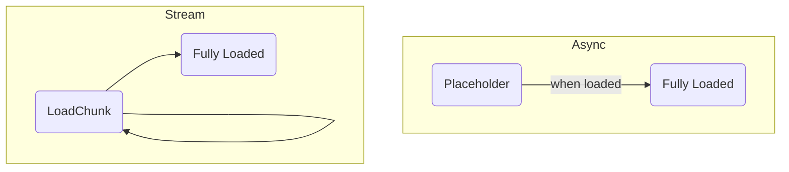
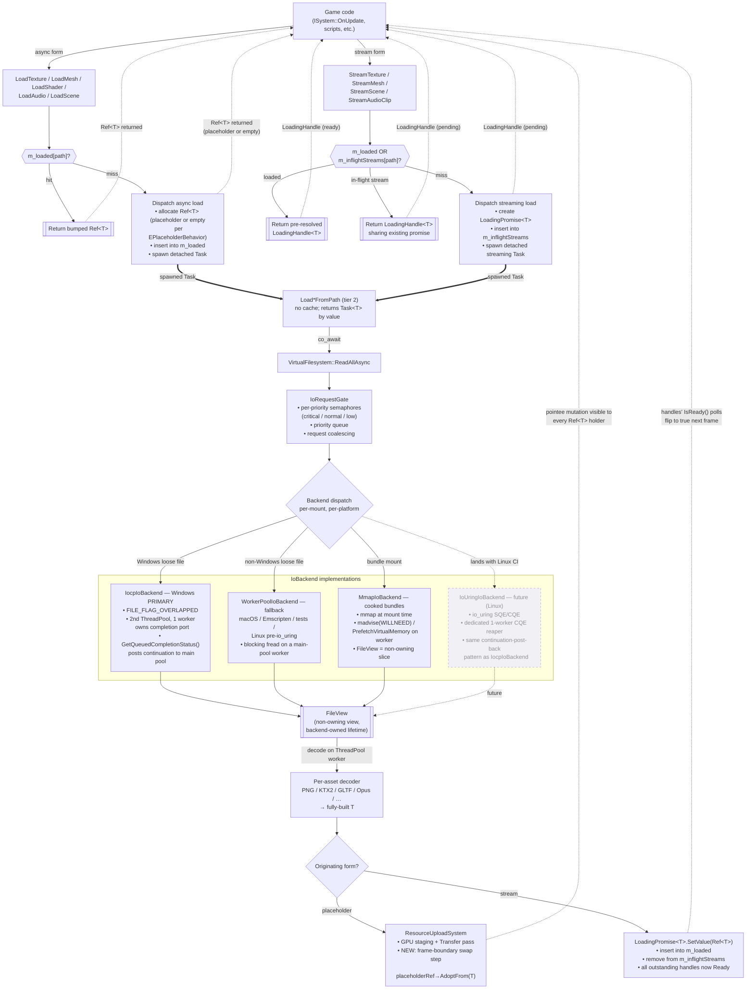

# Async Asset Loading Design

## Context

Today, all asset loads in the engine run synchronously on the calling thread. `ResourceManager::LoadTexture` opens the file via `VirtualFilesystem::OpenFile` (`src/engine_core/filesystem/src/VirtualFilesystem.hpp`), reads bytes with C-style `fread` through `CFileSystem`, and decodes inline. The `IFile` interface explicitly notes `TODO: async interfaces.` (`src/engine_core/filesystem/src/IFile.hpp:84`). Main thread is blocked for the full duration of I/O + decode.

Meanwhile, the threading layer already ships mature coroutine infrastructure — `Task<T>` (`src/engine_core/threading/src/async/Task.hpp`), `SyncWait`, `WhenAll`, `SelfDeleteTask`, a `ThreadPool` with work-stealing queues (`src/engine_core/threading/src/executors/ThreadPool.hpp`), and a `TaskOperation` awaiter. None of it is used by the loader. The existing `ResourceUploadSystem` already defers GPU uploads to a render-thread Transfer pass, so there is already a render-side deferral boundary to hook into.

**All of Hush asset loading should be async-first, fast-returning, with optional placeholders.** Additionally, it should provide a streaming layer for cases like scene loading and music streaming.

This design covers the following properties:

- Fully integrated with the existing `co_await` / `Task<T>` system.
- **Placeholder and swap:** `LoadTexture` never blocks. Whether the placeholder is used is **configurable per-call** via `EPlaceholderBehavior` — the user chooses placeholder or empty, the engine owns what the placeholder looks like.
- **I/O budgeting** so streaming cannot saturate the disk or stall the OS.
- **Native-first:** Windows IOCP / Linux io_uring as the primary loose-file backends. A `WorkerPoolIoBackend` — a small (1–2 thread, lower-priority) worker pool — serves as the cross-platform fallback and the right fit for non-kernel-async VFS mounts (zip archives, potential network VFS). `epoll` is explicitly rejected — it does not truly async regular files on Linux; it considers them always-ready.
- **First-class mmap backend** for cooked contiguous asset bundles, paired with an async prefetch wrapper so mmap page-faults never land on the main thread.
- Two load shapes — **async** (one-shot placeholder→loaded transition) and **stream** (progressive chunk→chunk→loaded transition). Each asset type supports one or both.

### Load-shape transitions



The async path is a single atomic visible transition (what the game sees is either placeholder or loaded, never in-between). The stream path exposes chunks as they arrive — engine systems subscribe to per-chunk events (e.g., `AudioMixerSystem` plays chunks as they come in; the scene-instantiation system creates entities as their records arrive). `Task<T>`-destructor cancellation is out of scope. A token-parameter form of cancellation is included so call sites are future-proof, but the tokens are not wired through callers yet.

`Task<T>`-destructor cancellation is out of scope. A token-parameter form of cancellation is included so the call sites are future-proof, but the tokens are not wired through callers yet.

### Relationship to the existing `IFileSystem` / `IFile`

**This design does not drop `IFileSystem` or `IFile`.** The existing interfaces stay in place for:

- Directory listing and metadata queries (`IFile::GetFileInfo`, path iteration).
- Write operations — config save, screenshot output, cooker output, editor save-as.
- Stream-style reads that use `Seek` — anything that does not fit in memory, or needs random access to parts of a file without mapping the whole thing.
- Non-`CFileSystem` VFS implementations (zip archives, packed formats, potential network VFS). These will not, in general, gain an IOCP path — their underlying storage model does not map to kernel-async reads. They remain on the sync/legacy path.

What the new design replaces is **one specific hot path**: "open this asset file, read it entirely into memory, decode it, release the file." That path is a large majority of asset loads by frequency, but a tiny fraction of the filesystem surface by capability.

Concretely:

- `VirtualFilesystem` *grows* a new method `ReadAllAsync(path, priority, token) -> Task<FileView>`. It does not remove `OpenFile`.
- `IIoBackend` is a sibling layer, not a replacement for `IFileSystem`. The backend is chosen per-mount and per-platform (see the Architecture section). On the `CFileSystem` mount on Windows, `ReadAllAsync` goes through `IocpIoBackend`; on a hypothetical `ZipFileSystem` mount, `ReadAllAsync` would either fall back to reading through the zip reader on a thread-pool worker or simply not support the async path and force callers to the legacy `OpenFile` route.
- `IFile::Read(std::size_t) -> Result<std::span<std::byte>>` — the mmap-friendly overload already present (`IFile.hpp:126`) — continues to exist for direct-access use cases outside the async loader (e.g., editor tools inspecting raw bytes).
- Loader call sites inside `ResourceManager` migrate from `OpenFile`+`Read` to `ReadAllAsync`. Non-loader call sites (editor, tools, write paths) are untouched.

### Constraint: user systems are synchronous

`ISystem` (`src/engine_core/core/src/ISystem.hpp`) lifecycle hooks — `Init`, `OnUpdate`, `OnFixedUpdate`, `OnShutdown`, `OnRender`, `OnPreRender`, `OnPostRender` — all return `void`. They are not coroutines and cannot `co_await`. The scripting bridge (`ScriptingSystemInterface`) exposes plain C function pointers for the same reason. **User code — gameplay systems, scripts, native game logic — can therefore call only the sync loader API** (the `LoadX` and `StreamX` methods below). The coroutine `LoadXAsync` forms are engine-internal (cooker, importer, editor preloader, asset pipeline, background tasks); they are exposed but only usable in coroutine contexts.

This is why every sync `LoadX` must return something usable in the same frame the call happens. The two shapes that satisfy that constraint:

1. **Async form** (`LoadTexture`, `LoadMesh`, `LoadShader`, `LoadScene`) — returns `Ref<T>` immediately. The pointee is either a placeholder (when `EPlaceholderBehavior::UsePlaceholder` is chosen and the asset type supports one) or an "empty" state (empty mesh, empty scene, null texture, etc.). A single atomic swap flips the pointee to the loaded data.
2. **Stream form** (`StreamTexture`, `StreamMesh`, `StreamScene`, `StreamAudioClip`) — returns a `LoadingHandle<T>` that exposes chunk-by-chunk progress. Engine systems subscribe to per-chunk events; `Take()` returns a `Ref<T>` once streaming completes.

Users never pass their own placeholders — they choose *whether* to have one (when the asset type offers the choice), not *what* it looks like. The engine owns the placeholder catalogue.

## Target API

### Async loader API — `LoadX`

Every `LoadX` returns a `Ref<T>` immediately. The pointee starts as a placeholder (if the asset type supports one and placeholder behavior is enabled) or in an "empty" state, and is swapped to the loaded data atomically when ready. This API is callable from any `ISystem` hook / script / plain function.

```cpp
enum class ELoadPriority    : std::uint8_t { Critical, Normal, Low };
enum class EPlaceholderBehavior : std::uint8_t { UsePlaceholder, NoPlaceholder };

Ref<TextureComponent> ResourceManager::LoadTexture(
    std::string_view     path,
    ELoadPriority        priority     = EELoadPriority::Normal,
    EPlaceholderBehavior placeholder  = EPlaceholderBehavior::UsePlaceholder);

// Shaders: placeholder is mandatory (magenta error shader). Not opt-out.
Ref<ShaderAsset> LoadShader(std::string_view path,
                            EELoadPriority priority = EELoadPriority::Normal);

// Meshes / scenes / audio samples: no placeholder. Pointee starts in an empty state
// and is swapped in on completion. Still returns a Ref<T> immediately.
Ref<MeshAsset>   LoadMesh (std::string_view path, ELoadPriority = EELoadPriority::Normal);
Ref<AudioClip>   LoadAudio(std::string_view path, ELoadPriority = EELoadPriority::Normal);

// LoadScene loads the scene *asset*. Activating a scene is separate:
// engine->LoadScene(sceneAsset) makes a scene active.
Ref<SceneAsset>  LoadScene(std::string_view path, ELoadPriority = EELoadPriority::Normal);
```

Per-asset policy summary:

| Asset               | Placeholder default        | Opt-out? | Empty state          |
|---------------------|----------------------------|----------|----------------------|
| `TextureComponent`  | checkerboard (configurable via `EPlaceholderBehavior`) | Yes — user chooses | null `m_texture` → renderer skips |
| `ShaderAsset`       | magenta error shader       | **No** (mandatory) | n/a                  |
| `MeshAsset`         | none                       | n/a      | empty mesh (renderer skips) |
| `SceneAsset`        | none                       | n/a      | empty entities list  |
| `AudioClip` sample  | none                       | n/a      | empty sample data    |

### Streaming loader API — `StreamX`

Every `StreamX` returns a `LoadingHandle<T>` immediately. Chunks arrive progressively; engine systems can subscribe to per-chunk events. `Take()` yields a `Ref<T>` once streaming completes.

```cpp
LoadingHandle<TextureComponent> ResourceManager::StreamTexture(
    std::string_view     path,
    ELoadPriority        priority    = EELoadPriority::Normal,
    EPlaceholderBehavior placeholder = EPlaceholderBehavior::UsePlaceholder);

LoadingHandle<MeshAsset>   StreamMesh  (std::string_view path, ELoadPriority = EELoadPriority::Normal);

// Critical path for engine->LoadSceneAsync.
LoadingHandle<SceneAsset>  StreamScene (std::string_view path, ELoadPriority = EELoadPriority::Normal);

// Music / ambient. Short SFX / voice use the synchronous LoadAudio above.
LoadingHandle<AudioClip>   StreamAudioClip(std::string_view path, ELoadPriority = EELoadPriority::Normal);
```

Audio is the clearest example of why both forms exist: short SFX ("gunshot.ogg", 50 KB) belongs on `LoadAudio` — one-shot, fully decoded, played back from memory. Long music ("theme.ogg", 10 MB) belongs on `StreamAudioClip` — the mixer subscribes and plays chunks as they arrive.

**`LoadingHandle<T>` — user-facing surface:**
```cpp
template <typename T>
class LoadingHandle
{
public:
    enum class EError
    {
        None,
        FileNotFound,
        InvalidFormat,
        DecodeFailed,
        IoError,
        Cancelled,
    };

    bool   IsReady()  const noexcept;
    bool   IsFailed() const noexcept;
    EError GetError() const noexcept;

    void   Wait() const;           // block until Ready | Failed | Cancelled (not for ISystem hot path)
    Ref<T> Take() const;           // snapshot current Ref<T>; semantics while still loading are TBD
    void   DropReference();        // explicit release; usually RAII handles this

    void   Cancel();               // stop loading if still in flight
    ~LoadingHandle() { Cancel(); } // auto-cancel on destruction
};
```

Typical poll pattern from `ISystem::OnUpdate`:
```cpp
void MyLoadingSystem::OnUpdate(float dt)
{
    if (m_handle.IsFailed()) { LogLoadError(m_handle.GetError()); return; }
    if (!m_handle.IsReady()) return;
    m_entity.GetComponent<TextureComponent>().SetTexture(m_handle.Take());
}
```

An alternative to per-caller polling is a proposed engine-owned `LoadingSystem` that auto-applies loaded assets to their target components — see Open Questions.

### Coroutine API — `LoadXAsync`

Exposed, but only usable from coroutine contexts — background `Task<>` jobs, the cooker, the importer, the editor preloader, scripted build pipelines. Game systems can only call these from a coroutine they explicitly spawned themselves; `ISystem` hooks still cannot `co_await` directly.

Cache-aware: returns a `Ref<T>`, not a `T` by value. Duplicate concurrent requests for the same path share one read + one decode + one constructed object (see "Deduplication and the ResourceManager cache"). Failures surface through the `Task<T>` exception channel.

```cpp
Task<Ref<TextureComponent>> LoadTextureAsync(
    std::string_view  path,
    ELoadPriority     priority = EELoadPriority::Normal,
    CancellationToken token    = {});

Task<Ref<MeshAsset>>   LoadMeshAsync  (...);
Task<Ref<ShaderAsset>> LoadShaderAsync(...);
Task<Ref<AudioClip>>   LoadAudioAsync (...);
Task<Ref<SceneAsset>>  LoadSceneAsync (...);
```

Usage from a background task:
```cpp
Task<> PreloadLevelAssets(ResourceManager &mgr)
{
    auto tex   = co_await mgr.LoadTextureAsync("res://level01/albedo.png");
    auto mesh  = co_await mgr.LoadMeshAsync   ("res://level01/terrain.glb");
    // ... assets are now fully loaded and cached.
}
```

### Filesystem primitive — the byte-level read used by every loader

```cpp
Task<FileView> VirtualFilesystem::ReadAllAsync(
    std::string_view path,
    ELoadPriority    priority = EELoadPriority::Normal,
    CancellationToken token   = {});
```

### `FileView` — non-owning view with backend-owned lifetime

```cpp
class FileView
{
public:
    std::span<const std::byte> GetData() const noexcept;
    std::size_t                GetSize() const noexcept;

    FileView(FileView &&) noexcept;
    FileView &operator=(FileView &&) noexcept;
    FileView(const FileView &)            = delete;
    FileView &operator=(const FileView &) = delete;
    ~FileView();   // releases backing: frees heap buffer, or munmaps, depending on backend

private:
    struct IBackingData;
    std::unique_ptr<IBackingData> m_backing;
    const std::byte          *m_ptr;
    std::size_t               m_len;
};
```

Callers see `std::span<const std::byte>` regardless of whether the bytes live in a heap buffer (thread-pool backend) or inside a kernel mapping (mmap backend). No branch, no type-check. The span is valid for the `FileView`'s lifetime only — the usual non-owning rules.

The existing `IFile::Read(std::size_t) -> Result<std::span<std::byte>>` overload (`IFile.hpp:126`) already anticipates this shape; `FileView` is its owning wrapper.

## Deduplication and the `ResourceManager` cache

A naive `LoadTexture("x.png")` that spawns a fresh read+decode on every call would re-read the file, re-decode it, and construct a new `TextureComponent` for each caller. Asset loading requires cache dedup above the byte-level coalescing in `IoRequestGate`.

### Existing cache: what's already there and what's missing

The current `ResourceManager` (`src/engine_core/resources/src/ResourceManager.hpp`) already has the bones of a cache — but not the pieces async dispatch needs. Being explicit so the implementation doesn't reinvent it:

**Already present:**
- `m_loadedResources: unordered_map<uint64_t, HandleId>` (`ResourceManager.hpp:126`) — path-hash → opaque asset handle. Key is `Hashing::Fnv1a64(path)`.
- `m_references: unordered_map<HandleId, RefCounted>` (`ResourceManager.hpp:124`) — handle → atomic refcount + deleter. `RefCounted` at `IResourceManager.hpp:19–31` is already the right shape (`std::atomic<size_t>` count, `void* element`, `Deleter`).
- `m_deletionQueue: vector<HandleId>` (`ResourceManager.hpp:125`) + `FreePending()` (`ResourceManager.cpp:50–59`) — deferred deletion, presumably drained once per frame.
- `AllocateRef<T>(identifier, args...)` template (`ResourceManager.hpp:105–121`) — generic "lookup by hash; construct + insert on miss; return `Ref<T>`." This is the prior art the async design layers onto; `LoadTexture` currently duplicates this logic inline at `ResourceManager.cpp:64–71` / `140–143`, which should be consolidated as part of the integration.
- `Ref<T>` copy-constructor refcount bump (`Ref.hpp:50–55`). Multiple callers already share one underlying asset correctly on cache hit — each gets a distinct `Ref<T>` pointing at the same handle, the atomic count rises as expected.

**Missing / broken for async:**
- **No locking.** `m_loadedResources`, `m_references`, `m_deletionQueue` are plain `unordered_map`/`vector`. Dispatch from `ThreadPool` workers races with the main thread. A single `std::mutex m_cacheMutex` guarding all three is the minimum fix. `m_deletionQueue.emplace_back` at `ResourceManager.cpp:40` also races with `FreePending` today.
- **No in-flight tracker.** Only *completed* loads are in `m_loadedResources`. For async-form loads a dispatch-time insert into `m_loadedResources` (with a placeholder/empty pointee) covers dedup, but streaming loads need a separate map — `m_inflightStreams: uint64_t → LoadingPromise<?>*` — because no `Ref<T>` exists until the stream completes.
- **No dispatch-time insertion.** Today's `LoadTexture` inserts into the cache only *after* decode completes (`ResourceManager.cpp:140–143`). Placeholder-form dispatch needs to insert a placeholder-backed `Ref<T>` *before* I/O begins so concurrent callers share it.
- **No path normalization.** `Hashing::Fnv1a64` runs directly on the input string. `"x.png"` and `"./x.png"` create distinct entries. `VirtualFilesystem::NormalizePath` must exist (or be added) and be the canonicalization step applied before hashing.
- **Ref-zero mid-load.** `DecreaseRefCount` enqueues deletion as soon as count hits zero (`ResourceManager.cpp:38–41`). If all game-side `Ref`s drop while the load task is still running, the pointee is deleted under the task. Mitigation: the load task owns a strong `Ref<T>` for its full duration.
- **`Ref<T>::IsNull()` does a map lookup.** `Ref.hpp:42–46` routes through `GetRefCount` which indexes `m_references`. Cold-path OK, but async code polls null/liveness often; cache the `RefCounted*` inside `Ref<T>` at construction time.
- **No `LoadingHandle` / `LoadingPromise`.** Not present anywhere in the codebase; a new single-header `src/engine_core/resources/src/LoadingHandle.hpp` is required.

**API shape note for current `LoadTexture`:** today it is declared at `ResourceManager.hpp:82–84` as `Result<Ref<TextureComponent>, EError> LoadTexture(std::string_view path, TextureComponent::ECpuUnloadStrategy = UnloadAfterUpload)`. The async design's `LoadTexture(path, ELoadPriority, EPlaceholderBehavior)` needs to decide whether to preserve the `Result<>` wrapping (sync errors like "file not found" bubble synchronously) or fold error surfacing entirely into the `LoadingHandle` / exception channel. Recommendation: keep `Result<>` for sync pre-flight errors (path not found, permission denied at dispatch time) and use the exception channel for async errors (decode failure, disk I/O error mid-read). `ECpuUnloadStrategy` stays as a parameter.

### Three-layer decode pipeline

Each asset type has three tiers, cleanly separated:

```cpp
// 1. Pure decode — no I/O, no cache. Takes bytes, returns a built T by value.
TextureComponent DecodeTexture(FileView);

// 2. Path-level load — reads file + decodes. No cache. Returns T by value.
Task<TextureComponent> LoadTextureFromPath(
    std::string_view path, ELoadPriority, CancellationToken);

// 3. Cache-aware entry point — returns a Ref<T> (cached or fresh).
//    Only calls LoadTextureFromPath on cache miss.
Task<Ref<TextureComponent>> LoadTextureAsync(
    std::string_view path, ELoadPriority, CancellationToken);
```

All user-facing sync loaders (`LoadTexture`, `LoadMesh`, etc.) and all streaming loaders (`StreamTexture`, `StreamMesh`, etc.) go through tier 3. Tiers 1–2 exist because the cooker, import pipeline, and test harness occasionally want the un-cached or even byte-direct path.

### Two caches in `ResourceManager`

- **`m_loaded`**: `path → Ref<T>`. The permanent cache. Populated on first request, retained for the lifetime of the `ResourceManager` (subject to eviction; see Open Questions). A `Ref<T>` sitting here may be in any of three states: pointing at a placeholder (load in flight with `EPlaceholderBehavior::UsePlaceholder`), pointing at an empty sentinel (load in flight with `NoPlaceholder`, or an asset type with no placeholder like mesh/scene), or pointing at real data (load complete).
- **`m_inflightStreams`**: `path → LoadingPromise<T>`. In-flight tracker for streaming loads only. Entry is removed when the stream completes. (Async loads don't need an in-flight map — the `Ref<T>` itself sits in `m_loaded` from dispatch time and serves as the dedup anchor.)

### Per-form dispatch

**Async form** (`LoadTexture`, `LoadMesh`, `LoadShader`, `LoadAudio`, `LoadScene`):
1. Check `m_loaded[path]` — hit? Return a bumped `Ref<T>`. A concurrent caller who arrives during step 3 below lands here.
2. Miss: allocate a new pointee in the manager. If `EPlaceholderBehavior::UsePlaceholder` and the asset type supports one, initialize fields from the shared placeholder; otherwise leave in the empty state (null texture, empty mesh, empty scene, etc.). Wrap in a `Ref<T>`, insert into `m_loaded[path]`, return the `Ref<T>`.
3. In parallel: spawn the decode task (`LoadTextureFromPath`, etc.). On completion, `ResourceUploadSystem.QueueSwap(cachedRef, std::move(decoded))` does `AdoptFrom` on the pointee. Every existing holder of `Ref<T>` sees the mutation.
4. A second call during step 3 hits step 1 and shares the same pointer; the single swap updates both callers simultaneously.

**Stream form** (`StreamTexture`, `StreamMesh`, `StreamScene`, `StreamAudioClip`):
1. Check `m_loaded[path]` — hit? Return a pre-resolved `LoadingHandle<T>` (`IsReady()` already true, `Take()` returns the cached `Ref<T>`).
2. Check `m_inflightStreams[path]` — hit? Construct a new `LoadingHandle<T>` sharing the existing `LoadingPromise<T>`. The new handle sees all already-delivered chunks and is subscribed for future ones. Return it.
3. Miss on both: create a `LoadingPromise<T>`, insert into `m_inflightStreams[path]`, return a `LoadingHandle<T>` bound to it. Spawn the streaming decode task. Chunks fire subscription callbacks as they arrive. On completion:
   - Allocate the `Ref<T>` in the manager, insert into `m_loaded[path]`.
   - Set the `LoadingPromise<T>` value to that `Ref<T>`. All outstanding handles now report `IsReady()`.
   - Remove from `m_inflightStreams`.

**Cache-aware coroutine form** (`Load*Async`):
- Same logic as the async form, but `co_await`s completion and returns `Ref<T>` directly instead of returning immediately on step 2. Used by engine-internal coroutine code (cooker, importer, preloader).

### Interaction with `IoRequestGate` coalescing

The gate's byte-level coalescing becomes *mostly* redundant for asset loads, because duplicate requests are deduplicated at the `ResourceManager` layer before reaching the gate. The gate still earns its keep for:

- Raw-byte reads outside the asset pipeline (editor tools, cooker, manual file inspection).
- Same file requested through different logical paths (e.g., `res://` and an aliased mount) — cache keying is by canonical path but normalization edge cases will exist; byte-level coalescing catches those.
- Streams, where the cache dedup applies per-file but the gate governs the per-chunk submission rate.

Both layers are kept.

## Architecture

Solid arrows are the async data flow; dashed arrows are "visible effect / returns immediately" paths.



### Reading the diagram

- **Two entry shapes converge into the same async load.** `Game` calls either an async-form loader (`LoadTexture`, `LoadMesh`, etc.) or a stream-form loader (`StreamTexture`, `StreamScene`, etc.). Both check the `ResourceManager` cache first — five out of six cache outcomes let the caller return immediately with no I/O at all. Only the two cache-miss branches spawn a detached `Task<>`.
- **The cache short-circuits.** The dashed return arrows from `R1` / `RH1` / `RH2` are pure cache hits — no thread pool involvement. This is where deduplication happens: a second call for the same path shares whatever state the first call produced.
- **`LWP` and `LAD` differ only in how they publish the eventual result.** Both spawn the same underlying tier-2 decode task (`Load*FromPath`). The difference is at the completion end — `LWP` routes into the swap queue on `ResourceUploadSystem`, `LAD` routes into a `LoadingPromise`.
- **`VFS → Gate → Backend dispatch`** is where budgeting, prioritization, and byte-level coalescing happen. Every async read passes through the same gate regardless of which backend runs underneath.
- **The four backends** are not alternatives picked at configuration time — they run concurrently within the same process. `bundle://` mounts use `MmapIoBackend`; `res://` mounts on Windows use `IocpIoBackend`; the same `res://` on macOS uses `WorkerPoolIoBackend`. A single process can have all three live at once.
- **`FileView` is the unified choke point** where backend differences collapse: after this node, no downstream code knows or cares how the bytes got here.
- **Two completion paths, one decoder.** The `Branch` node after `Dec` is implicit in the code — the load task knows which form spawned it and routes accordingly. The async path mutates the pointee; the stream path resolves the promise. Both effects become visible to the game code on its next frame (or next poll of the `LoadingHandle`).

## Key Design Decisions

**Why IOCP is the primary Windows backend from day one, not a staged-later goal.**
Windows is the only platform the engine currently builds in CI, so the performant path should ship on the validated platform. A thread-pool-that-blocks-in-`fread` backend on Windows would be code written to be thrown away, and would leak the "worker blocked in I/O" cost into the main `ThreadPool` during every level load. IOCP is also the most mature of the three candidate native primitives — `OVERLAPPED` + completion ports is well-understood engineering with decades of reference material, unlike `io_uring`'s still-evolving API surface. The up-front platform-specific cost is paid once, and the non-Windows thread-pool fallback is a genuinely cheap backend (tens of lines) because its only job is blocking `fread`.

**Why the IOCP backend uses a second `ThreadPool` instance with one dedicated worker, not a bespoke I/O thread class.**
The existing `ThreadPool` is already the right abstraction — it owns workers, a queue, and a `TaskOperation` awaiter that resumes coroutines. Constructing a second instance with `num_workers = 1` gives a thread whose only work is `GetQueuedCompletionStatus()` in a loop, isolated from the compute workers. Upsides over a bespoke `IoThread` class: no new type hierarchy, the completion worker has the same lifecycle and shutdown story as every other thread in the engine, Tracy/profiler instrumentation already in place for `ThreadPool` applies automatically, and if load grows later the pool can be resized from 1 to N with zero code changes. The completion worker never runs coroutine continuations itself — on a CQE/completion, it posts the continuation back to the *main* `ThreadPool` and returns to polling. Compute workers never block on I/O; the completion worker never runs user code.

**Why `epoll` is rejected outright.**
`epoll` treats regular files as always-ready and does not gate on disk I/O completion. It is useful for sockets and pipes, not for file reads. The correct Linux primitive for async file I/O is `io_uring` (5.1+, with matured ops in 5.19+). POSIX AIO is an option on very old kernels but is typically thread-pool-emulated anyway, which is what the `WorkerPoolIoBackend` fallback already provides.

**Why kernel-visible buffers are pinned in the coroutine frame, and cancellation is a no-op.**
`ReadFileEx` (and later, `io_uring_submit`) hand the kernel a pointer and a length. The kernel writes to that buffer asynchronously — destroying the buffer before the completion fires corrupts whatever memory happens to land at that address next (often: crashes). The simplest safe scheme is "buffer lifetime tied to the coroutine frame that submitted the read." The coroutine awaits the completion; when it resumes, the buffer is moved into the returned `FileView`; if the coroutine is never resumed (token-cancelled), the buffer is still alive on the frame until the kernel signals done, at which point the frame can be destroyed. Token cancellation therefore means "don't act on the result," not "pull the buffer out from under the kernel." This keeps the implementation correct without any buffer-tracking registry.

**Why the request gate also bounds submissions to the kernel, not just worker concurrency.**
With a thread-pool backend the gate bounds concurrency because workers are the bottleneck. With IOCP the kernel will happily accept thousands of submissions — but each one pins a buffer and a completion packet, and the disk itself has a finite queue depth (typically 32–64 for NVMe). The gate's per-priority semaphores therefore do double duty: capping both worker fan-out (for thread-pool backend) and submitted-but-uncompleted read count (for IOCP/io_uring backends). One policy, two correctness arguments.

**Why error handling goes through the `Task<>` exception channel even though it is a hot path.**
`ReadFileEx` reports sync errors via `GetLastError()`; the completion packet carries async errors in its status field. Both are rare (missing file, disk I/O error). Normal success is the overwhelming case, so throwing-on-error through the `Task<>` exception channel costs nothing in steady state. The completion worker wraps the error into an exception object and posts a continuation that rethrows on resume; no caller-visible difference from the thread-pool backend's throwing path.

**Why a request gate sits in front of the backend.**
An unbounded fan-out of concurrent reads saturates the disk queue, freezes competing applications, and on HDDs can multiply seek time. The gate enforces concurrent-in-flight budgets, applies priority ordering, and coalesces duplicate requests for the same path. All three properties are backend-agnostic: the same gate code runs in front of the thread-pool, mmap, or native-async backend.

**Why per-priority budgets (critical / normal / low).**
A single shared pool lets a low-priority background prefetch (e.g., "load the next room") occupy all the slots and starve a critical load (e.g., "player jumped to a new area right now"). Separate per-tier budgets make starvation structurally impossible. Starting guesses: critical = 4 concurrent reads / unbounded bytes; normal = 2 / 16 MB per frame; low = 1 / 4 MB per frame. Tune on target hardware.

**Why `FileView` is the shared return type for *all* backends.**
mmap wants to hand out raw pointers directly into a kernel-managed mapping; heap-buffer backends want to hand out pointers into a freshly allocated buffer. A non-owning view with backend-owned lifetime unifies both. The destructor dispatches through a small type-erased backing — `munmap` / `UnmapViewOfFile` for mmap, `free` for heap. Decoders do not branch on backend.

**Why mmap is always wrapped by an async worker.**
`mmap()` itself is cheap — it installs VMAs; no data is read yet. The expensive part is the page-fault on first access, which is a synchronous blocking disk read on whichever thread touches the page. If main or render threads touch cold pages inline, latency hiccups show up in frame time. The async wrapper schedules `madvise(MADV_WILLNEED)` (Linux) / `PrefetchVirtualMemory` (Windows 8+, falling back to a manual touch loop on older) on a worker, and resolves the `Task<FileView>` only after the prefetch returns. Main thread then touches the bytes with no fault.

**Why per-mount backend selection, not one global backend.**
Different asset storage shapes want different primitives; forcing one backend everywhere sacrifices either zero-copy (for bundles) or transform-friendliness (for compressed loose files). `VirtualFilesystem` already does mount-based path resolution (`src/engine_core/filesystem/src/VirtualFilesystem.cpp`); each mount carries its own `IIoBackend`. A `bundle://` mount selects the mmap backend; a `res://` loose-file mount selects the thread-pool backend.

| Storage shape                               | Windows              | Linux                              | macOS / Emscripten     |
|---------------------------------------------|----------------------|------------------------------------|------------------------|
| Cooked contiguous bundle (GPU-ready format) | `MmapIoBackend`      | `MmapIoBackend`                    | `MmapIoBackend`        |
| Loose compressed/transformed files          | `IocpIoBackend`      | `WorkerPoolIoBackend` → `IoUringIoBackend` (future) | `WorkerPoolIoBackend` |
| Hot-reload / editor scratch                 | `IocpIoBackend`      | `WorkerPoolIoBackend` → `IoUringIoBackend` (future) | `WorkerPoolIoBackend` |
| Cross-process shared asset DB               | `MmapIoBackend`      | `MmapIoBackend`                    | `MmapIoBackend`        |

**Why the swap lives inside the pointee, not by rebinding the `Ref<T>`.**
`Ref<T>` (`src/engine_core/resources/src/Ref.hpp`) is non-intrusive and handle-keyed — the `HandleId → IResourceManager*` binding is fixed at construction, and the manager owns the resource lifetime. Rebinding a `Ref<T>` to a different resource on the fly is hostile to this model. The pointee is mutable, however, so the swap mutates fields *inside* the asset object. All 100 holders of `Ref<TextureComponent>` already point at the same `TextureComponent`; an `AdoptFrom(T&&)` on that component is visible to every holder for free, with zero changes to `Ref<T>` itself.

**Why a generic `LoadAsyncWithPlaceholder<T>` helper, not per-asset glue.**
Every asset type wants the identical pattern: allocate pointing at a placeholder → spawn the loader → queue a swap when ready. Writing it five times (textures, meshes, shaders, audio, scenes) and again for every future asset type is copy-paste of non-trivial coroutine + lifetime + upload-system plumbing. A single helper with a `Swappable<T>` concept centralizes the contract with `ResourceUploadSystem` and shrinks every `Load*` to three lines.

**Why the render-thread sync point, not atomics.**
`ResourceUploadSystem` already runs at a frame boundary and already holds the contract for GPU staging. Extending it to also call `AdoptFrom` on pending swaps keeps the render hot path lock-free and atomics-free, and puts all mutation of asset state in one well-defined moment. Atomic pointers in `TextureComponent::m_texture` would work but would add synchronization on every draw-call read for no benefit — frame-boundary is strictly coarser than draw-call granularity and costs nothing.

**Why meshes / scenes / audio samples have no placeholder, and how "empty state" differs from "no Ref<T> at all."**
A placeholder's job is to communicate "this is still loading / this is missing" in a useful way. A checkerboard texture does that; a magenta error shader does that. An "empty mesh" communicates nothing visually — rendering skips it, indistinguishable from no-mesh-assigned. Same for audio (silence = not playing) and scenes (empty entities = scene not loaded). Rather than invent a visual sentinel, the async-form `LoadMesh` / `LoadScene` / `LoadAudio` return a `Ref<T>` pointing at an **empty-state pointee** (empty mesh data, empty entity list, null sample buffer). The `Ref<T>` itself is always valid; the data is what's empty. Renderers/mixers naturally skip empty state with a single null/size-zero check they already do. The pointee is swapped to real data atomically when the load completes.

**Why the placeholder is a per-call `EPlaceholderBehavior` parameter, not a separate loader method.**
Rendering the magenta checkerboard is visually obvious and surfaces missing/slow assets immediately during development — it is the right default. But UI, menus, cinematics, and contexts where "visible placeholder" is worse than "show nothing yet" need the empty path. Rather than split into `LoadTexture` vs. `LoadTextureNoPlaceholder`, the single `LoadTexture(path, priority, EPlaceholderBehavior)` parameter exposes the choice inline. Two reasons for this over separate methods: (1) every asset type with a placeholder option exposes the same parameter in the same position — predictable across `LoadTexture`, `StreamTexture`; (2) the placeholder catalogue stays central to the engine — users pick a *behavior*, never a specific placeholder asset.

**Why shaders make the placeholder mandatory.**
Unlike textures where "show nothing yet" can be appropriate (UI, cutscenes), a shader without a fallback means the object can't be drawn at all — which is identical to the object being missing, with no way for the developer to tell the difference. The magenta error shader is the standard industry cue: "this is broken/loading, and here's where to look." Taking away that affordance has no upside; no `EPlaceholderBehavior` parameter on `LoadShader`.

**Why `LoadingHandle<T>` uses a custom promise, not `std::future`.**
`std::future` pulls in heap-allocated shared state, `std::exception_ptr` plumbing, and memory-order guarantees (the one-time set + wait semantics are stricter than we need). Asset loading does not benefit from any of it. The custom promise is a single atomic state enum (`Pending → Ready | Failed | Cancelled`), `alignas(T)` storage for a `Ref<T>`, and an `std::exception_ptr` for failures. The producer (detached `Task<>` on a worker) writes the result; the consumer (`ISystem::OnUpdate`) polls via `IsReady()`. Shared ownership between producer and consumer is via a small intrusive refcount on the promise itself — same pattern as `Ref<T>` / `ResourceManager::RefCounted`. No `std::shared_ptr` control block.

**Why token-parameter cancellation, not destructor cancellation in `Task<T>`.**
Destroying a `Task<T>` mid-flight calls `coroutine.destroy()` (`Task.hpp:242`), which runs any continuation stored in `TaskOperation` (`ThreadPool.cpp:224–239`) — and that continuation is likely a dangling pointer by the time the worker pops it. Fixing this properly is a thread-safety project across the whole coroutine layer and belongs on its own. A `CancellationToken` parameter on every async load op is cheap to thread through now, checks at natural boundaries (between file chunks, before GPU upload), and is invisible to callers that don't use it (defaults to a never-cancelling token). Caller-level semantics stay "loads always complete, stale swaps are a no-op if the `Ref` is gone" — the token merely lets individual operations short-circuit opportunistically.

## Pieces to Build

Split into three phases. Phase A cleans up the existing `ResourceManager` cache so Phase B has a stable platform to build on; Phase B adds async machinery; Phase C is per-asset-type integration.

### Phase A — prerequisite cache/refcount work on existing `ResourceManager`

These stand on their own merit even before async lands. Every gap here is currently hostile to concurrent load dispatch.

A1. **Thread-safety on `ResourceManager` maps.** Add a single `std::mutex m_cacheMutex` guarding `m_loadedResources`, `m_references`, and `m_deletionQueue`. All current `Load*`, `IncreaseRefCount`, `DecreaseRefCount`, `FreePending` paths acquire it. Revisit with `std::shared_mutex` only if profiling shows contention.
A2. **Consolidate inline cache logic onto a single helper.** `LoadTexture` (`ResourceManager.cpp:64–71` and `140–143`) duplicates the lookup+insert pattern already present in `AllocateRef<T>` (`ResourceManager.hpp:105–121`). Extend `AllocateRef<T>` to also return a `bool inserted` (or split into `LookupRef<T>` + `InsertRef<T>`). All `LoadX` implementations route through it.
A3. **Path normalization before hashing.** `VirtualFilesystem::NormalizePath(std::string_view) -> std::string`. Canonicalize separators, strip `./`, resolve `../`, lowercase on Windows. All cache keys derive from the normalized form, so `"assets/x.png"` and `"./assets/x.png"` land on the same entry.
A4. **Optimize `Ref<T>::IsNull()`** to avoid the `GetRefCount` map lookup on every call. Cache the `RefCounted*` inside `Ref<T>` at construction (one extra pointer field). `IsNull()` becomes `m_element == INVALID_HANDLE || m_refCounted->IsNull()`.
A5. **Guard against ref-zero deletion during a live load.** The load task holds a strong `Ref<T>` for its full duration — natural fix, no new in-flight flag needed.

### Phase B — new async machinery

B1. **`CancellationToken`** — new type in `src/engine_core/threading/src/async/`. `stop_source`-shaped, no `Task<T>` integration. Default-constructed token never cancels.
B2. **`ELoadPriority` enum + `IoRequestGate`** — new in `src/engine_core/filesystem/src/`. Per-priority counting semaphores, priority queue, coalescing map keyed by canonical path.
B3. **`FileView`** — in `src/engine_core/filesystem/src/`. Non-owning view over bytes with a type-erased `IBackingData` (heap or mmap). Movable, non-copyable. `GetData()` / `GetSize()` accessors.
B4. **`IIoBackend` interface** — methods `Task<FileView> ReadAll(path, range, priority, token)` and `AsyncGenerator<FileView> Stream(path, chunkSize, priority, token)`.
B5. **`IocpIoBackend`** (Windows primary):
   - A second `ThreadPool` instance with one dedicated worker, owning the completion port. The worker loops on `GetQueuedCompletionStatus()` and does nothing else.
   - `ReadAll(...)`: opens with `FILE_FLAG_OVERLAPPED`, allocates a buffer owned by the coroutine frame, submits `ReadFile` keyed by an `OVERLAPPED*` that carries the awaiter state.
   - On completion: the dedicated worker records success/error on the awaiter and posts the coroutine continuation to the *main* `ThreadPool`. Never runs user code itself.
   - Shutdown: `PostQueuedCompletionStatus(m_port, 0, 0, nullptr)` sentinel drains the dedicated worker.
B6. **`WorkerPoolIoBackend`** — cross-platform fallback and the backend for non-kernel-async mounts (zip archives, network VFS if added). A small (1–2 worker) lower-priority `ThreadPool` instance; workers do blocking `fread` / archive-reader calls. Kept simple; its job is portability and test-harness support.
B7. **`MmapIoBackend`** — mount-scoped. At mount time: open + `mmap`/`MapViewOfFile` the bundle, keep the mapping for the mount lifetime. `ReadAllAsync(path, range)`: schedules `madvise(MADV_WILLNEED)` / `PrefetchVirtualMemory` on a main-pool worker, resolves `Task<FileView>` after prefetch. `FileView` is a non-owning slice; destructor is a no-op. `SIGBUS` / `EXCEPTION_IN_PAGE_ERROR` surface as `Task<FileView>` exception.
B8. **`VirtualFilesystem` mount machinery** — each mount carries its own `IIoBackend`. Path resolution picks backend per-mount per-platform (e.g., `bundle://` → `MmapIoBackend`; `res://` on Windows → `IocpIoBackend`; `res://` elsewhere → `WorkerPoolIoBackend`).
B9. **`VirtualFilesystem::ReadAllAsync(path, priority, token) -> Task<FileView>`** — dispatches to the mount's backend through the gate.
B10. **`LoadingHandle<T>` + `LoadingPromise<T>`** — new single-header `src/engine_core/resources/src/LoadingHandle.hpp`. Custom promise mirroring the existing `RefCounted` intrusive-refcount pattern; API per the concrete sketch below (`IsReady`, `IsFailed`, `GetError`, `Wait`, `Take`, `DropReference`, `Cancel`).
B11. **`AsyncGenerator<T>`** — coroutine type for the streaming backend, in `src/engine_core/threading/src/async/`. `co_yield` produces one value; consumer `co_await`s `Next()`.
B12. **Bounded MPSC channel** — used inside `LoadingHandle<T>` for stream-path chunk delivery. Semaphore-gated on capacity for backpressure.
B13. **`m_inflightStreams: unordered_map<uint64_t, LoadingPromise<?>*>`** — added to `ResourceManager`, guarded by the Phase A1 mutex. Transient tracker for in-flight stream loads.

### Phase C — per-asset-type integration

C1. **`Swappable<T>` concept + `AdoptFrom(T &&)` methods** — on every asset type: `TextureComponent`, `ShaderAsset`, `MeshAsset`, `SceneAsset`, `AudioClip`. All participate in the swap path (empty-state → loaded, or placeholder → loaded).
C2. **Placeholder asset catalogue (only for types with a visual placeholder)** — default checkerboard `TextureComponent` (procedural 2×2 or 4×4, uploaded at startup) and magenta error `ShaderAsset`. Nothing for mesh/scene/audio; their empty state IS the "no placeholder" state.
C3. **Three-tier decode pipeline for each asset type:**
    - Tier 1: `Decode*(FileView) -> T` — pure decode, no I/O, no cache.
    - Tier 2: `Load*FromPath(path) -> Task<T>` — reads file + decodes. No cache.
    - Tier 3: `Load*Async(path) -> Task<Ref<T>>` — cache-aware; consults `m_loaded`, calls tier 2 only on miss.
C4. **Per-asset sync `LoadX` methods** — async form; all return `Ref<T>` immediately. Signature per Target API. Routes through the Phase A2 consolidated helper and Phase B10's `AdoptFrom` path.
C5. **Per-asset sync `StreamX` methods** — stream form; all return `LoadingHandle<T>`. Route through `m_inflightStreams` + `LoadingPromise<T>`.
C6. **`ResourceUploadSystem` extension** — new frame-boundary step that dequeues pending swaps (one pass, handles both async-form swap and stream-completion swap) and calls `AdoptFrom` on each target pointee. Runs after existing staging/upload step.
C7. **(Optional now, recommended soon.) `LoadingSystem` ISystem** — auto-applies ready `LoadingHandle<T>`s to their target components based on a registered binding, so gameplay code doesn't have to poll by hand. See Open Questions.

### Future, not this PR

F1. **`IoUringIoBackend`** — drop-in replacement for `WorkerPoolIoBackend` on Linux loose-file mounts once Linux CI exists. Same dedicated-1-worker pattern as `IocpIoBackend`. Public API does not change.
F2. **`Task<T>`-level cancellation** — destructor safety, ambient tokens, `TaskOperation` lifetime fix.
F3. **Eviction policy for `m_loaded`** — LRU or memory-budget-based. Currently everything lives until `ResourceManager` shutdown.

## Swap Helper — Concrete Sketch

```cpp
// In a common header (e.g. src/engine_core/resources/src/Swappable.hpp):
template <typename T>
concept Swappable = requires(T &a, T &&b) {
    { a.AdoptFrom(std::move(b)) } -> std::same_as<void>;
};

template <Swappable T, typename LoaderFn>
    requires std::invocable<LoaderFn> &&
             std::same_as<std::invoke_result_t<LoaderFn>, Task<T>>
Ref<T> LoadAsyncWithPlaceholder(
    ResourceManager &mgr,
    Ref<T>           placeholder,
    LoaderFn         loader,   // templatized; no std::function heap alloc
    ELoadPriority    priority = ELoadPriority::Normal)
{
    SpawnOn(mgr.GetThreadPool(),
        [placeholder,
         loader       = std::move(loader),
         &uploadSystem = mgr.GetUploadSystem()]() mutable -> Task<>
        {
            T loaded = co_await loader();
            uploadSystem.QueueSwap(placeholder, std::move(loaded));
        });
    return placeholder;
}

// Per-asset-type sync loader — cache-aware, placeholder form:
Ref<TextureComponent> ResourceManager::LoadTexture(std::string_view path)
{
    // Cache hit (loaded OR in-flight placeholder-backed) → share the existing Ref.
    if (auto hit = LookupLoaded<TextureComponent>(path); hit)
        return *hit;

    // Miss: allocate a placeholder-initialized pointee in the manager,
    // insert into m_loaded under this path, then spawn the async load
    // that will AdoptFrom when ready.
    Ref<TextureComponent> ref = AllocateFromPlaceholder<TextureComponent>(
        path, GetDefaultPlaceholderTexture());

    return LoadAsyncWithPlaceholder<TextureComponent>(
        *this,
        ref,
        // Note: passes the TIER-2 function (returns Task<T> by value for AdoptFrom),
        // not the tier-3 cache-aware one (returns Task<Ref<T>>).
        [this, p = std::string(path)]() -> Task<TextureComponent> {
            co_return co_await LoadTextureFromPath(p);
        });
}

// On each swappable asset type:
void TextureComponent::AdoptFrom(TextureComponent &&other)
{
    m_texture  = std::exchange(other.m_texture,  nullptr);
    m_cpuImage = std::exchange(other.m_cpuImage, {});
    m_format   = other.m_format;
    // …
}
```

## `FileView` — Concrete Sketch

```cpp
class FileView
{
    struct IBackingData
    {
        virtual ~IBackingData() = default;
    };

    struct HeapBacking final : IBackingData
    {
        std::unique_ptr<std::byte[]> data;
        std::size_t                  size;
    };

    struct MmapBacking final : IBackingData
    {
        void        *addr;
        std::size_t  length;
        ~MmapBacking() override;   // munmap / UnmapViewOfFile
    };

    std::unique_ptr<IBackingData> m_backing;
    const std::byte          *m_ptr;
    std::size_t               m_len;

public:
    std::span<const std::byte> data() const noexcept { return {m_ptr, m_len}; }
    std::size_t                size() const noexcept { return m_len; }

    FileView(FileView &&) noexcept            = default;
    FileView &operator=(FileView &&) noexcept = default;
    FileView(const FileView &)                = delete;
    FileView &operator=(const FileView &)     = delete;
};
```

## `LoadingHandle<T>` — Concrete Sketch

Custom promise with atomic state and intrusive refcount, matching the lightweight style of `Ref<T>` rather than `std::shared_ptr<std::future<...>>`.

```cpp
template <typename T>
class LoadingPromise
{
public:
    enum class State : std::uint8_t { Pending, Ready, Failed, Cancelled };

    LoadingPromise() noexcept = default;
    LoadingPromise(const LoadingPromise &)            = delete;
    LoadingPromise &operator=(const LoadingPromise &) = delete;

    using EError = typename LoadingHandle<T>::EError;

    // Producer side — called once by the loader task on completion.
    void SetValue(Ref<T> value) noexcept
    {
        new (m_storage) Ref<T>(std::move(value));
        m_state.store(State::Ready, std::memory_order_release);
        m_completion.notify_all();
    }
    void SetError(EError err) noexcept
    {
        m_error = err;
        m_state.store(State::Failed, std::memory_order_release);
        m_completion.notify_all();
    }
    void MarkCancelled() noexcept
    {
        m_state.store(State::Cancelled, std::memory_order_release);
        m_completion.notify_all();
    }

    // Consumer side.
    State  GetState()   const noexcept { return m_state.load(std::memory_order_acquire); }
    EError GetError()   const noexcept { return m_error; }
    Ref<T> Take() noexcept   // precondition: state == Ready
    {
        auto *slot = std::launder(reinterpret_cast<Ref<T> *>(m_storage));
        Ref<T> out = std::move(*slot);
        slot->~Ref();
        return out;
    }
    void Wait() const noexcept
    {
        // Block until Ready, Failed, or Cancelled.
        State s = GetState();
        while (s == State::Pending) {
            m_state.wait(static_cast<std::uint8_t>(State::Pending), std::memory_order_acquire);
            s = GetState();
        }
    }

    // Intrusive refcount — mirrors Ref<T>/ResourceManager::RefCounted pattern.
    void Retain() noexcept  { m_refcount.fetch_add(1, std::memory_order_relaxed); }
    void Release() noexcept {
        if (m_refcount.fetch_sub(1, std::memory_order_acq_rel) == 1)
            delete this;
    }

private:
    std::atomic<State>         m_state      = State::Pending;
    std::atomic<std::uint32_t> m_refcount   = 1;
    alignas(Ref<T>) std::byte  m_storage[sizeof(Ref<T>)]{};
    EError                     m_error      = EError::None;
    // m_state doubles as the wait/notify futex; no separate condvar needed.
    mutable std::atomic<std::uint8_t> &m_completion = *reinterpret_cast<std::atomic<std::uint8_t> *>(&m_state);
};

template <typename T>
class LoadingHandle
{
public:
    enum class EError
    {
        None,
        FileNotFound,
        InvalidFormat,
        DecodeFailed,
        IoError,
        Cancelled,
    };

    LoadingHandle() noexcept = default;
    explicit LoadingHandle(LoadingPromise<T> *p) noexcept : m_promise(p) { if (p) p->Retain(); }

    LoadingHandle(const LoadingHandle &rhs) noexcept : m_promise(rhs.m_promise)
    { if (m_promise) m_promise->Retain(); }
    LoadingHandle(LoadingHandle &&rhs) noexcept
        : m_promise(std::exchange(rhs.m_promise, nullptr)) {}

    LoadingHandle &operator=(LoadingHandle rhs) noexcept  // copy-and-swap
    { std::swap(m_promise, rhs.m_promise); return *this; }

    // Auto-cancels on destruction per user-facing surface.
    ~LoadingHandle()
    {
        Cancel();
        if (m_promise) m_promise->Release();
    }

    bool IsReady()  const noexcept
    { return m_promise && m_promise->GetState() == LoadingPromise<T>::State::Ready; }

    bool IsFailed() const noexcept
    { return m_promise && m_promise->GetState() == LoadingPromise<T>::State::Failed; }

    EError GetError() const noexcept
    { return m_promise ? m_promise->GetError() : EError::None; }

    void   Wait() const { if (m_promise) m_promise->Wait(); }

    Ref<T> Take() const  // precondition: IsReady() (see Open Questions re partial-progress semantics)
    { return m_promise->Take(); }

    void   DropReference() noexcept
    {
        if (m_promise) { m_promise->Release(); m_promise = nullptr; }
    }

    void Cancel() noexcept
    { if (m_promise) m_promise->MarkCancelled(); }

private:
    LoadingPromise<T> *m_promise = nullptr;
};
```

### Streaming-load helper

```cpp
template <typename T, typename LoaderFn>
    requires std::invocable<LoaderFn> &&
             std::same_as<std::invoke_result_t<LoaderFn>, Task<Ref<T>>>
LoadingHandle<T> LoadAsyncStream(
    ResourceManager &mgr,
    std::string_view path,
    LoaderFn         loader,       // tier-3 cache-aware loader
    ELoadPriority    priority = ELoadPriority::Normal)
{
    // Cache check: if already loaded, return a pre-resolved handle.
    if (auto hit = mgr.LookupLoaded<T>(path); hit) {
        auto *p = new LoadingPromise<T>();
        p->SetValue(*hit);
        return LoadingHandle<T>(p);
    }

    // In-flight check: share the existing promise.
    if (auto *existing = mgr.LookupInflight<T>(path); existing)
        return LoadingHandle<T>(existing);

    // Miss: create a new promise, register it, spawn the load.
    auto *promise = new LoadingPromise<T>();
    mgr.RegisterInflight<T>(path, promise);
    LoadingHandle<T> handle(promise);

    SpawnOn(mgr.GetThreadPool(),
        [promise, loader = std::move(loader),
         &mgr, p = std::string(path)]() mutable -> Task<> {
            try {
                Ref<T> ref = co_await loader();
                mgr.UnregisterInflight<T>(p);
                promise->SetValue(std::move(ref));
            }
            catch (...) {
                mgr.UnregisterInflight<T>(p);
                promise->SetException(std::current_exception());
            }
            promise->Release();  // drop the producer's reference
        });

    promise->Retain();   // producer reference; balanced by Release above
    return handle;
}
```

### What this sketch illustrates

- **Intrusive refcount, not `std::shared_ptr`.** Matches the `Ref<T>` / `ResourceManager::RefCounted` pattern already used in the engine. One heap allocation per promise; no separate control block.
- **`alignas(Ref<T>)` inline storage.** The `Ref<T>` result lives inside the promise, not in a separate heap slot. Placement-new on `SetValue`, explicit destructor on `Take`.
- **Acquire-release on the state atomic.** The consumer's `IsReady()` does an acquire-load; once it reads `Ready`, it synchronizes-with the producer's `SetValue` release-store, making the placement-new visible.
- **Cancellation is a flag, not a cooperation.** The producer keeps running; the consumer simply chooses not to consume the result. Matches the "loads always complete" policy.
- **Streaming helper mirrors the async helper.** Same shape — templated loader, `SpawnOn` the pool, store the result when ready. The async helper (`LoadAsyncWithPlaceholder`) routes the result into `AdoptFrom`; the streaming helper (`LoadAsyncStream`) routes it into a `LoadingPromise`.

## `IocpIoBackend` — Concrete Sketch

Concrete shape of the Windows-primary backend, illustrating the completion-port lifecycle, the `OVERLAPPED` extension pattern, the dedicated-1-worker-ThreadPool design, and the continuation hand-off to the main pool.

### The operation packet

`OVERLAPPED` must be the first member so `CONTAINING_RECORD` can recover the outer struct from the `LPOVERLAPPED` the kernel returns on completion.

```cpp
struct IocpReadOp
{
    OVERLAPPED                   overlapped;   // MUST be first member
    std::coroutine_handle<>      continuation;
    std::unique_ptr<std::byte[]> buffer;
    std::size_t                  bufferSize      = 0;
    DWORD                        bytesTransferred = 0;
    DWORD                        errorCode       = ERROR_SUCCESS;
    HANDLE                       file            = INVALID_HANDLE_VALUE;
};
```

The `buffer` is pinned here, on the heap, for the lifetime of the op. The kernel writes into it asynchronously; it must stay alive until completion. This struct itself is owned by the coroutine frame that issued the read.

### The awaiter

The awaiter submits the read on `await_suspend`, returns immediately, and lets the IOCP completion path resume the coroutine on a main-pool worker.

```cpp
struct IocpReadAwaiter
{
    IocpReadOp *op;
    ThreadPool *mainPool;
    std::uint64_t offset;

    bool await_ready() const noexcept { return false; }

    void await_suspend(std::coroutine_handle<> h) noexcept
    {
        op->continuation         = h;
        op->overlapped.Offset    = static_cast<DWORD>(offset & 0xFFFFFFFFu);
        op->overlapped.OffsetHigh = static_cast<DWORD>(offset >> 32);

        BOOL ok = ::ReadFile(
            op->file, op->buffer.get(),
            static_cast<DWORD>(op->bufferSize),
            nullptr, &op->overlapped);

        DWORD err = ::GetLastError();

        // ReadFile on an OVERLAPPED handle normally returns FALSE with
        // ERROR_IO_PENDING; the kernel will post completion to the port.
        if (!ok && err != ERROR_IO_PENDING)
        {
            // Sync failure — no completion will arrive. Post the continuation
            // ourselves so the coroutine wakes up and sees the error.
            op->errorCode = err;
            mainPool->Schedule([h]() noexcept { h.resume(); });
        }
        // Success or ERROR_IO_PENDING: completion thread will wake us.
    }

    void await_resume() const noexcept { /* caller reads op fields */ }
};
```

### The backend

```cpp
class IocpIoBackend final : public IIoBackend
{
public:
    IocpIoBackend(ThreadPool &mainPool)
        : m_mainPool(mainPool)
        , m_completionPool(/*numWorkers=*/ 1)
        , m_port(::CreateIoCompletionPort(INVALID_HANDLE_VALUE, nullptr, 0, 1))
    {
        m_completionPool.Schedule([this]() noexcept { RunCompletionLoop(); });
    }

    ~IocpIoBackend() override
    {
        // Sentinel: nullptr OVERLAPPED tells the loop to exit.
        ::PostQueuedCompletionStatus(m_port, 0, 0, nullptr);
        m_completionPool.Shutdown();              // joins the lone worker
        ::CloseHandle(m_port);
    }

    Task<FileView> ReadAll(
        std::string_view  path,
        Range             range,
        ELoadPriority     priority,
        CancellationToken token) override
    {
        HANDLE file = OpenForAsyncRead(path);     // CreateFileW + FILE_FLAG_OVERLAPPED
        ::CreateIoCompletionPort(file, m_port, /*key=*/ 0, 0);

        LARGE_INTEGER sz;
        ::GetFileSizeEx(file, &sz);
        const std::size_t size = range.length
            ? range.length
            : static_cast<std::size_t>(sz.QuadPart);

        IocpReadOp op{};
        op.file       = file;
        op.buffer     = std::make_unique<std::byte[]>(size);
        op.bufferSize = size;

        co_await IocpReadAwaiter{&op, &m_mainPool, range.offset};

        ::CloseHandle(file);

        if (op.errorCode != ERROR_SUCCESS)
        {
            throw std::system_error(
                op.errorCode, std::system_category(), "IOCP ReadAll");
        }

        co_return FileView::FromHeap(
            std::move(op.buffer), op.bytesTransferred);
    }

    AsyncGenerator<FileView> Stream(
        std::string_view  path,
        std::size_t       chunkSize,
        ELoadPriority     priority,
        CancellationToken token) override
    {
        HANDLE file = OpenForAsyncRead(path, /*sequentialScanHint=*/ true);
        ::CreateIoCompletionPort(file, m_port, 0, 0);

        LARGE_INTEGER sz;
        ::GetFileSizeEx(file, &sz);
        const std::uint64_t fileSize = sz.QuadPart;

        std::uint64_t offset = 0;
        while (offset < fileSize)
        {
            if (token.IsCancelled())
                break;

            const std::size_t toRead = static_cast<std::size_t>(
                std::min<std::uint64_t>(chunkSize, fileSize - offset));

            IocpReadOp op{};
            op.file       = file;
            op.buffer     = std::make_unique<std::byte[]>(toRead);
            op.bufferSize = toRead;

            co_await IocpReadAwaiter{&op, &m_mainPool, offset};

            if (op.errorCode != ERROR_SUCCESS)
            {
                ::CloseHandle(file);
                throw std::system_error(
                    op.errorCode, std::system_category(), "IOCP Stream");
            }

            offset += op.bytesTransferred;
            co_yield FileView::FromHeap(
                std::move(op.buffer), op.bytesTransferred);
        }

        ::CloseHandle(file);
    }

private:
    void RunCompletionLoop() noexcept
    {
        for (;;)
        {
            DWORD        bytes = 0;
            ULONG_PTR    key   = 0;
            LPOVERLAPPED lp    = nullptr;
            BOOL         ok    = ::GetQueuedCompletionStatus(
                                    m_port, &bytes, &key, &lp, INFINITE);

            if (lp == nullptr)
                return;   // shutdown sentinel

            auto *op = CONTAINING_RECORD(lp, IocpReadOp, overlapped);
            op->bytesTransferred = bytes;
            op->errorCode        = ok ? ERROR_SUCCESS : ::GetLastError();

            // CRITICAL: do NOT resume the coroutine here. Post it to the
            // main pool so this worker stays free to reap further completions.
            m_mainPool.Schedule(
                [h = op->continuation]() noexcept { h.resume(); });
        }
    }

    ThreadPool &m_mainPool;
    ThreadPool  m_completionPool;   // one dedicated worker, nothing else
    HANDLE      m_port;
};
```

### What the sketch illustrates

- **Single completion port shared by all files in the backend.** One `CreateIoCompletionPort(INVALID_HANDLE_VALUE, …)` at construction creates the port; each opened file is associated with the port via `CreateIoCompletionPort(file, m_port, …)`. All completions flow through one queue.
- **`OVERLAPPED` first-member trick.** `CONTAINING_RECORD` recovers the outer `IocpReadOp` from the `LPOVERLAPPED` the kernel hands back. This is the idiomatic Win32 pattern for extending `OVERLAPPED` with per-op state.
- **Buffer lifetime is the coroutine frame's responsibility.** `op.buffer` lives inside `IocpReadOp`, which lives on the coroutine frame. If the coroutine is destroyed mid-flight (e.g., through token cancellation), the kernel may still write into the buffer. This is why the cancellation semantics are "don't observe the result," not "pull the buffer out" — the buffer stays alive until the kernel completes. `Task<T>`-destructor cancellation (a separate future project) would need to address this via buffer quarantine.
- **Continuation runs on the main pool, never on the completion worker.** `RunCompletionLoop` never calls `h.resume()` directly. It schedules the continuation on `m_mainPool` and immediately loops back to `GetQueuedCompletionStatus`. Long user code (decode, adopt, anything) cannot serialize behind other completions.
- **Sync failure path.** `ReadFile` on an `OVERLAPPED` handle *usually* returns `ERROR_IO_PENDING`, but can return a real error synchronously (e.g., closed file mid-submit). In that case no completion packet will arrive — the awaiter posts the continuation itself so the coroutine wakes and sees the error.
- **Shutdown is clean.** `PostQueuedCompletionStatus(m_port, 0, 0, nullptr)` posts a sentinel (null `OVERLAPPED*`) that `RunCompletionLoop` checks for and returns. The completion pool's `Shutdown` then joins the worker before `CloseHandle(m_port)` runs.
- **Streaming is just `ReadAll` in a loop.** Same packet, same awaiter, offsets advanced per iteration. `co_yield` returns the chunk; the `AsyncGenerator` awaits the consumer before the loop issues the next read — which is where backpressure happens.
- **`OpenForAsyncRead` details elided.** A small helper that calls `CreateFileW(..., FILE_FLAG_OVERLAPPED | FILE_FLAG_SEQUENTIAL_SCAN, ...)`. UTF-8 → wide conversion uses existing `StringUtils` (`src/engine_core/core/src/StringUtils.cpp`).

### Intentionally not shown

- **File-handle caching.** `CreateFile`/`CloseHandle` per read is fine on Windows (handle creation is microseconds). If profiling shows it, an LRU of `(path → HANDLE)` could be added later.
- **`FILE_FLAG_NO_BUFFERING`.** Bypasses the OS cache; requires page-aligned buffers and offsets. Not worth the complexity for asset loads — OS cache is actively helpful here.
- **Gate integration.** Omitted from the sketch for brevity. `ReadAll` and `Stream` would acquire a priority-tier semaphore before submitting the read and release it on completion. The gate lives in `VirtualFilesystem::ReadAllAsync`, which wraps the backend call.
- **Cancellation token checks inside `ReadAll`.** A single-shot read has no natural check point between submit and completion — either trust the token check before submit, or use `CancelIoEx(file, &op->overlapped)` to abort an in-flight read. The latter is more code for marginal benefit on sub-millisecond reads; defer until needed.

## Streaming Loads

The async-form `LoadX` assumes one atomic transition: empty-or-placeholder → fully loaded. Two important workloads produce usable results progressively instead:

- **Long audio clips** (music, ambient). A 10 MB background track shouldn't sit in memory as a compressed blob and decode in one shot. Decoders process small chunks (OGG Vorbis pages, Opus packets, MP3 frames) and feed a ring buffer. The clip "starts playing" as soon as the first chunk is decoded. Short clips (SFX, voice lines) do NOT stream — they use the async `LoadAudio` which loads fully and swaps in.
- **Large scenes.** A 50 MB scene with 10,000 entities should not `ReadAllAsync` → parse → instantiate-all in a single frame (→ multi-hundred-millisecond spike). The loader emits entities as they are deserialized, and the game can instantiate N per frame, spreading the cost. A partially populated scene is a valid intermediate state: gameplay runs on whatever entities exist so far.

The `StreamX` return type is `LoadingHandle<T>` (see Target API). Internally the engine needs two lower-level primitives to implement it:

### Engine-internal API

```cpp
// A coroutine-based async generator yielding one FileView per chunk.
// Used by the stream-path implementation inside ResourceManager.
template <typename T>
class AsyncGenerator { /* co_yield T; co_return; */ };

AsyncGenerator<FileView> VirtualFilesystem::StreamAsync(
    std::string_view  path,
    std::size_t       chunkSize,
    ELoadPriority     priority,
    CancellationToken token = {});

// Consumer (internal engine code — audio decoder, scene parser, etc.):
auto stream = vfs.StreamAsync(path, 64 * 1024, ELoadPriority::Normal);
while (auto chunk = co_await stream.Next()) {
    co_await decoder.Consume(*chunk);
}
```

The user-facing `LoadingHandle<T>` returned by `StreamTexture` / `StreamMesh` / `StreamScene` / `StreamAudioClip` wraps an `AsyncGenerator<FileView>` running on a worker. The worker pipes chunks into per-handle subscription events and, when complete, sets the `LoadingPromise<T>` value so all outstanding handles flip to `IsReady()`.

### Backpressure

The channel's bounded capacity **is** the backpressure mechanism. No separate pause/resume protocol.

- Producer submits the next backend read only when `channel.size() < capacity`.
- When capacity is hit, the producer coroutine suspends (no in-flight read beyond capacity; kernel-submitted reads are not pre-queued past the limit either).
- Consumer pops at whatever pace it runs.
- When the consumer pops, the producer coroutine is resumed and issues the next read.

For IOCP specifically: "suspend producer until channel has room" translates to "don't call `ReadFileEx` yet." No additional throttling logic. When the consumer pops, the producer's continuation is scheduled on the main ThreadPool and it submits the next read.

### Backend support

| Backend                | Supports streaming? | Notes                                                     |
|------------------------|---------------------|-----------------------------------------------------------|
| `IocpIoBackend`        | Yes                 | Sequential `ReadFileEx` calls, one per chunk              |
| `WorkerPoolIoBackend`  | Yes                 | Sequential `fread`s on a worker, one per chunk            |
| `MmapIoBackend`        | No                  | No natural chunk boundary; mapping gives all bytes at once. If a mount is mmap-backed and a streaming read is requested, `OpenStream` fails and the caller falls back (or the asset is reclassified to a non-mmap mount). |
| `IoUringIoBackend`     | Yes (future)        | `IORING_OP_READ` per chunk, pipelined submission          |

Streaming is a capability advertised by `IIoBackend`; the VFS routes streamed opens only to backends that support it.

### Audio integration

Audio has **two distinct entry points**, picked by the caller based on clip size/purpose:

- **Short / one-shot:** `LoadAudio(path) -> Ref<AudioClip>`. SFX, voice lines, UI sounds, short stings. Loaded fully, decoded on a worker, swapped in. Rendered silent until swap; since SSD reads + decode on small OGG/Opus are sub-10ms, this is fine.
- **Long / streamed:** `StreamAudioClip(path) -> LoadingHandle<AudioClip>`. Music, ambient beds, dialogue that might be minutes long. The `AudioMixerSystem` subscribes to the handle's chunk events and feeds its ring buffer as chunks arrive.

The choice is not automatic based on file size — the caller picks by which method they call. This matches how audio is typically used at the API level: code that calls `LoadAudio` already knows the clip is meant for one-shot playback.

### Scene streaming

Scene streaming requires a **binary scene format variant** — not the existing JSON format documented in `docs/ideas/scene-system-design.md`. JSON is hostile to SAX-style chunked parsing; every streamed chunk would need to find a record boundary inside a text structure. Binary is the right primitive here:

- Length-prefixed entity records: `[record_size:u32][record_type:u16][payload]...`
- Stream can align read chunks to record boundaries easily (read header → read exactly `record_size` more bytes → yield one entity).
- Per-record type tag lets the parser dispatch to the right deserializer without backtracking.

Small/editor scenes keep the JSON format. Large/cooked scenes use the binary format with streaming. The `SceneAsset` loader dispatches on file extension or magic bytes.

Game-side consumption:

- Async form: `LoadScene(path) -> Ref<SceneAsset>` returns immediately, empty entity list until swap. Good for editor / small scenes.
- Stream form: `StreamScene(path) -> LoadingHandle<SceneAsset>` for large cooked scenes. This is the critical path that `engine->LoadSceneAsync` is built on.
- A new engine system — `SceneStreamingSystem` — drives the stream from `OnUpdate`:
  - Pops up to `instantiateBudgetPerFrame` records per frame.
  - Parses each record, instantiates the entity (components, with parent links deferred to a second pass when all entities exist).
  - Calls `SceneAsset::OnEntityAdded` so game code can react.
- Instantiation budget is its own per-frame cap (N entities OR M milliseconds — whichever hits first), separate from the IO budget.
- Handle readiness (`LoadingHandle::IsReady()`) reports true once the stream completes and the parent-link second pass runs. `Take()` returns the final `Ref<SceneAsset>` at that point.

Crucially, `LoadScene` / `StreamScene` only load the **scene asset**. They do not make that scene the active scene; `engine->LoadScene(sceneAsset)` (or `engine->LoadSceneAsync`) activates it separately. This separation lets pre-streaming UX fully control the transition moment.

### Streaming — additional pieces (beyond Phase B already listed above)

- **Binary scene format (v2)** — length-prefixed records, magic bytes, version header. Separable design project; cross-reference from `scene-system-design.md`.
- **`SceneStreamingSystem`** — ISystem that drives scene streams, instantiates N entities per frame, runs the parent-link pass when complete.
- **`AudioMixerSystem` stream integration** — subscribes to `StreamAudioClip` handles, feeds ring buffer from chunk events, drives playback from its own `ISystem::OnUpdate`.
- **`VirtualFilesystem::StreamAsync`** — already listed under B4 as the generator-producing backend method.

### Streaming — open questions specific to this section

- **Short-clip threshold for audio.** 1 MB is a starting guess. Too low → wastes the streaming machinery on clips that would fit in memory fine. Too high → music tracks blow the budget. Configurable per-asset would be overkill.
- **Whether to coalesce streamed reads of the same path.** Coalescing is trivial for `ReadAllAsync` (share one result). For streams, two consumers at different pace positions can't share one stream. Probably: streams are never coalesced; each consumer gets its own stream. Two audio mixer instances playing the same track each open their own.
- **Scene-v2 format versioning and tooling.** A cooker step converts JSON scenes to binary. Editor still saves JSON; publish builds run the cooker. Deserves its own design doc.
- **Multi-reader streams.** A streamed scene might want multiple subsystems observing the same chunks (main instantiator + debug logger). Could fan out via a broadcast channel, but this adds complexity. For v1: single consumer per stream; if a second observer is needed, re-open the stream.

## Performance Considerations

The design hot paths, ranked by frequency of execution:

1. **Rendering** — thousands of draw calls per frame reading `TextureComponent::m_texture`.
2. **Frame-boundary swap step** — runs every frame inside `ResourceUploadSystem`, dispatches pending swaps.
3. **Load submission** — bursty at level-load (hundreds to thousands at once), low during gameplay.
4. **Per-request I/O + decode** — runs on worker threads, off the frame-critical path.

The design is structured so that the frequency-1 path (rendering) pays *zero* overhead from the async system:

- **No atomics or locks on the render hot path.** `TextureComponent::m_texture` is a plain pointer; the swap happens once, at a frame boundary, before any rendering work of that frame begins. Readers (draw-call recording) see a consistent value for the entire frame. Unlike an atomic-pointer design, there is no `memory_order_acquire` on every texture lookup.
- **No indirection added to `Ref<T>`.** The swap mutates the pointee, not the handle. The existing `Ref<T>` dereference path is unchanged. No extra pointer chase per draw.
- **Placeholder asset is a real, GPU-resident asset from startup.** There is no "is this loaded?" branch inside the renderer — it always has a valid `m_texture`, it just points at the checkerboard until the swap occurs. The branch exists only in gameplay code that explicitly chooses to gate on readiness.

### Per-concern notes

**Frame-boundary swap cost.** Each pending swap is an `AdoptFrom` call plus a GPU-upload enqueue. For a level-load that completes 1,000 textures on the same frame, naively draining the swap queue in one frame will spike frame time. Mitigation: cap the swap step at N swaps per frame (or a byte-budget of GPU upload), and let overflow roll to the next frame. The 128 MiB GPU staging buffer in `ResourceUploadSystem` already imposes a natural byte ceiling; the per-frame swap cap should be tuned against it. Starting guess: 16 swaps / 32 MiB of GPU upload per frame.

**Load-submission allocation patterns.** `LoadAsyncWithPlaceholder` is templated on the loader callable, so the lambda is captured by value without `std::function`'s small-buffer-or-heap behaviour. The detached `Task<>` itself is a coroutine-frame allocation — coroutine frame allocations are the dominant per-request cost in this design. Mitigations to consider if it shows up in profiles:
- Use a bump allocator or frame-pool for coroutine frames (C++20 supports promise-level custom `operator new`).
- Reuse the `Task<>` coroutine frame when loads are coalesced.

**Request coalescing.** The gate's coalescing map is keyed by canonical path. A second request for an in-flight path attaches a continuation to the existing request's completion list rather than issuing a second read. The lookup is `O(1)` expected; prefer a fast hash (FNV-1a or xxhash) over the default string hash. The coalescing list itself is append-only under lock for submission and drain-then-resume under lock for completion — both are rare compared to draws, so a plain mutex is fine here.

**Priority queue shape.** Three separate FIFO deques (one per priority tier) outperform a heap-based `std::priority_queue` for a fixed, small number of priorities. Deque pop + per-tier semaphore check is branch-predictable and cache-friendly. Use `std::deque<Request>` with a per-tier spinlock or a lock-free MPSC queue if the submission rate ever justifies it.

**mmap working-set pressure.** A large bundle mmap consumes virtual address space (cheap) but, once pages are touched, occupies the kernel page cache (not cheap). Two guardrails:
- Use `madvise(MADV_DONTNEED)` or `VirtualUnlock`-equivalents to evict ranges that the engine knows it will not re-read soon (e.g., assets from a level that was unloaded).
- Prefer *range-scoped* prefetch (only `MADV_WILLNEED` the bytes we are about to decode) rather than whole-file prefetch — this keeps the resident set bounded to the actively used subset.

**Decode throughput on workers.** The decoder (PNG / KTX2 / GLTF / etc.) is often CPU-bound and is where most of the per-asset cost lives. Runs on the existing `ThreadPool` via `TaskOperation`; no extra machinery. Points to watch:
- Prefer **KTX2 / BCn-compressed** cooked textures so the decoder becomes a memcpy + GPU block-compressed upload, not a full PNG decode.
- Batch small decodes on the same worker to amortize cache warmup on the decoder library's internal tables.

**GPU upload pipelining.** `ResourceUploadSystem` already batches uploads into the Transfer pass. The new swap step should enqueue the upload on the *same frame* it resolves, so the Transfer pass can bin it with other staged copies. Do not split "upload now, swap next frame" — that is a wasted frame of latency and doubles the bookkeeping.

**Refcount contention on shared placeholders.** The checkerboard placeholder is shared across every pending texture load. `LoadAsyncWithPlaceholder` takes a `Ref<T>` by value, which bumps the refcount on every call. Under a 1,000-texture level-load burst, that is 1,000 contended increments on one atomic. Typically this is still fast (single-cache-line atomic, no sharing between reads and writes on unrelated assets), but if it shows in profiles, alternatives are (a) pre-warm N placeholder refs in a thread-local pool, or (b) make the placeholder ref a plain pointer + manual refcount manipulation scoped to the helper.

**`FileView` type-erased destructor.** The `std::unique_ptr<IBackingData>` virtual destructor has a single virtual call per view destruction. This is a `O(1)` cost on a cold path (view is destroyed at most once per asset load); keep the code clean, don't optimize.

**Allocator friendliness.** All per-request data structures (coalescing entries, gate queue nodes, coroutine frames) should be pool-allocatable. Worth pre-agreeing on a shared `PoolAllocator` type before implementation so the first-pass code does not bake `std::allocator` assumptions that have to be undone later.

**No exceptions on the hot path.** I/O errors propagate through `Task<>::promise_type::unhandled_exception`, which catches and re-throws at the `co_await` site. That is acceptable for the error path but not the steady-state path — `ReadAllAsync` should not use exceptions to signal "no data yet" or any other common condition. Keep exceptions for genuine failures (missing file, SIGBUS, decode error).

### Not doing (and why)

- **Not sharding the gate per CPU core.** Would reduce lock contention on submission, but the submission rate (bursts at level-load) does not justify it. Revisit only if profiling shows gate-lock contention.
- **Not going lock-free on the swap queue.** A MPMC lock-free queue for swaps would remove the render-thread's drain lock. The drain runs once per frame and handles at most N items (capped); the lock is held for microseconds. Not worth the complexity.
- **Not implementing a custom coroutine allocator in the first pass.** Potentially impactful but requires changes inside `Task<T>`; keep the first pass using default allocation and measure before optimizing.

### IOCP-specific performance notes

- **Compute workers are never blocked on I/O on Windows.** The IOCP backend's only blocking call is `GetQueuedCompletionStatus` on the *dedicated* completion worker. Main-pool workers only ever run on work that is CPU-ready, so bursts of asset loads do not drain the compute pool. This is the property the thread-pool fallback cannot provide.
- **Kernel queue depth matches disk queue depth.** NVMe drives commonly accept 32–64 in-flight commands. IOCP + `ReadFileEx` lets the engine submit that many reads at once; the drive pipelines them with near-zero CPU cost per submission. The gate's per-priority budget should be set high enough to saturate the drive when needed (normal tier ≥ 16 concurrent reads on NVMe targets) and explicitly lower on HDD targets where concurrent reads cause seek thrash.
- **One extra thread, zero overhead when idle.** The completion worker is parked in `GetQueuedCompletionStatus` when no completions are pending — kernel wakes it only on an actual event. No polling loop, no wasted cycles.
- **Submission cost per read.** `ReadFileEx` costs one syscall. `OVERLAPPED` and the awaiter-state packet are stack- or coroutine-frame-allocated, not heap. If the coroutine-frame cost is the dominant per-request allocation (likely), reducing submission cost further is not worth the complexity.
- **Completion-to-resume latency.** Completion worker reads the packet, wakes a main-pool worker via `ThreadPool::Schedule()`, which resumes the coroutine. This is two thread hops. An alternative is to run the continuation directly on the completion worker — rejected, because that would serialize all completions behind whichever continuation happens to run longest. The two-hop path is the right default; a future optimization could mark cheap continuations (like "store result in awaiter, wake main thread next frame") for direct execution, but not in the first pass.

## Open Questions / Follow-ups

- **`LoadingSystem` ISystem — auto-apply loaded assets.** Users currently have to poll `LoadingHandle` in their own `OnUpdate` and call `Take()` + attach-to-component manually. An engine-owned `LoadingSystem` could accept a registration — "when this handle resolves, assign the result to this component on this entity" — and do the bookkeeping automatically. Pros: user code shrinks to one line of registration. Cons: adds a per-binding table and surfaces a subtle race (what if the entity is destroyed before the handle resolves?). Recommendation: design it as opt-in, added after the core `LoadingHandle` lands.
- **`LoadingHandle::Take()` semantics while still loading.** If the caller invokes `Take()` before `IsReady()`, what do they get — a `Ref<T>` pointing at the partial-progress intermediate (useful for streaming visualizations), a null `Ref<T>`, or UB with `IsReady()` as a precondition? Current sketch uses precondition-`IsReady()`, which is simplest. Revisit when a real use case (scene streaming progress bar?) surfaces.
- **Network VFS — do we want it?** Mentioned as "should we support this? I think this might be useful tbh." Serving assets over the network from a remote server enables fast iteration for distributed teams and on-device hot-reload. The `IIoBackend` / `WorkerPoolIoBackend` abstraction already accommodates it (network reads on a worker, same `FileView` return type). Main cost: security model (signed assets? auth?) and latency budgeting (network reads blow the gate's concurrency guesses). Defer decision until a concrete workflow asks for it.
- **`SceneAsset` placeholder-or-not.** Scenes are an edge case — an "empty scene" could plausibly be a visual placeholder (load-screen dummies while the real scene streams in). Current plan: `LoadScene` returns a `Ref<SceneAsset>` pointing at empty state, no visual placeholder. Revisit if level-transition UX needs something richer.
- **Cache eviction policy for `m_loaded`.** Memory grows monotonically without eviction. LRU, memory-budget-based, or explicit release. Deferred until the cache actually causes pressure — for the first pass, keep everything until `ResourceManager` shutdown.
- **Placement of `LoadingHandle<T>` source.** Lives naturally in `src/engine_core/resources/src/` (it returns `Ref<T>`), but the promise machinery is generic enough to belong in `threading/src/async/`. Decide based on whether any non-resource code wants a `LoadingHandle<T>` (probably not initially).
- **Budget tuning numbers.** Starting guesses: critical = 4 concurrent / unbounded bytes; normal = 2 / 16 MB per frame; low = 1 / 4 MB per frame. Confirm on target hardware.
- **Hot-reload in editor vs. the coalescing layer.** If an asset on disk changes while a read for it is in flight, does the coalescer return stale bytes to existing waiters, or invalidate and re-issue? Leaning toward "stale bytes to existing waiters, next request re-reads" to keep coalescing semantics simple.
- **Windows `PrefetchVirtualMemory` availability.** Windows 8+. For pre-8 targets, fall back to a manual touch loop on a worker. If the engine does not target pre-8, simply require it.
- **mmap error surfaces.** `SIGBUS` (Linux, file truncated mid-read) and `EXCEPTION_IN_PAGE_ERROR` (Windows, underlying disk error on a mapped page). Plan: install a per-process handler that translates to a fatal I/O exception, propagated via `Task<FileView>`.
- **Backend-selection defaults.** Which mount scheme maps to which backend by default, and how user projects override. Suggested: `bundle://` → mmap everywhere; `res://` / unspecified → `IocpIoBackend` on Windows, `WorkerPoolIoBackend` elsewhere until `IoUringIoBackend` lands.
- **Sizing of the IOCP completion ThreadPool.** Default is one worker. Keep at 1; revisit only if profiling shows the worker saturated.
- **`Task<T>` continuation hand-off from the completion worker.** The completion worker posts continuations to the main `ThreadPool` via `Schedule()`. Verify that's cheap enough at expected submission rates.
- **Preserve `Result<Ref<T>, EError>` on `LoadTexture` or fold into `LoadingHandle` error channel?** The current sync `LoadTexture` (`ResourceManager.hpp:82–84`) returns `Result<Ref<TextureComponent>, EError>`. Recommendation: keep `Result<>` for synchronous pre-flight errors (path not found at dispatch time, permission denied), use the exception channel for async errors (decode failure, disk I/O mid-read), and route stream errors through `LoadingHandle::GetError()`.

## Files Referenced

- `src/engine_core/filesystem/src/IFile.hpp` — TODO marker about async at line 84; `Read(std::size_t)` mmap-friendly overload at line 126.
- `src/engine_core/filesystem/src/VirtualFilesystem.hpp/.cpp` — where `ReadAllAsync` and per-mount backend selection land.
- `src/engine_core/filesystem/src/FileSystem.hpp` — existing (unused) `AsyncCallback` infrastructure.
- `src/engine_core/threading/src/async/Task.hpp` — `Task<T>` and awaiter contract.
- `src/engine_core/threading/src/async/SyncWait.hpp`, `WhenAll.hpp`, `SelfDeleteTask.hpp` — coroutine utilities already available.
- `src/engine_core/threading/src/executors/ThreadPool.hpp/.cpp` — backend target for worker-scheduled I/O and decode.
- `src/engine_core/resources/src/Ref.hpp` — handle-based, non-intrusive ref; pointee is mutable.
- `src/engine_core/resources/src/ResourceManager.hpp/.cpp` — loader entry points to extend.
- `src/engine_core/resources/src/ResourceUploadSystem.hpp/.cpp` — deferred GPU upload; extended with the swap step.
- `src/engine_core/resources/src/TextureComponent.hpp` — swap target (GPU handle + CPU image fields).
- `docs/ideas/scene-system-design.md` — sibling design doc; same style conventions.
