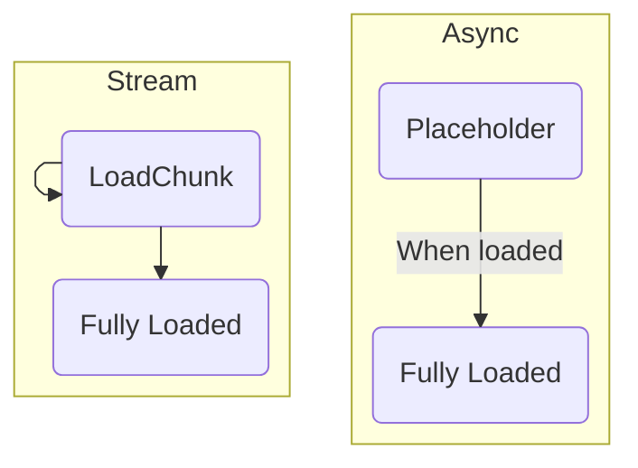
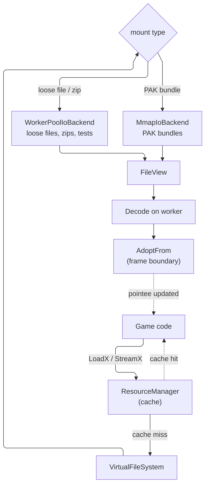

# Async Asset Loading

## What do we want?

All of hush asset loading should be async-first, fast returning, with optional placeholders. Additionally, it should provide a streaming layer for cases like scene loading and music streaming.

The transitions for each loading type is as follows:



The following properties will be covered:

* Fully integrated with the `Task<T>` system
* Placeholder and swap, this means that, when user loads a texture, it will never block. This behavior should be configurable so user can decide if they want a placeholder or not (per-call, via `EPlaceholderBehavior`)
* Streaming layer for long audio (music, ambient) and large scenes. Returns a `LoadingHandle<T>` with per-chunk subscription
* I/O budgeting, we don't want to saturate the disk or stall the OS
* First-class mmap backend for asset bundles (contiguous, for PAK-style formats)
* Cross-platform `WorkerPoolIoBackend` for everything else (loose files, zip archives, tests). A small ThreadPool (2-3 threads, lower priority)

In the future, if we see that the threadpool does not scale well, we can implement IOCP and io_uring as a backend.

`IFileSystem` stays as-is for things like: blocking reads, writes, random access stuff, and things like VFS for ZipArchives, network VFS (should we support this? I think this might be useful tbh), etc.

This idea is for the following use-case: **I want to load the following asset**.

* `VirtualFileSystem` will provide a new function: `Task<FileView> ReadAllAsync(path, priority)` and `AsyncGenerator<FileView> StreamAsync(path, chunkSize, priority)`.
* `IIoBackend`. Backend will be chosen depending on the type of mount, for instance for `CFileSystem` it will be `WorkerPoolIoBackend`, or for a PAK bundle mount it will be `MmapIoBackend`.

The overall flow looks like this:



The full async mechanism should be supported and exposed so that tools like the future `HushCooker` use it.

This, however, limits the user systems to use the sync versions (unless they fire a background job).

## Loader API

### User-facing

Everything must return a `Ref<T>` bound to an optional placeholder (placeholder is defined by the engine, not configurable for users).

```cpp
Ref<TextureComponent> ResourceManager::LoadTexture(
    std::string_view     path,
    ELoadPriority        priority    = ELoadPriority::Normal,
    EPlaceholderBehavior placeholder = EPlaceholderBehavior::UsePlaceholder);

// Stuff like meshes don't have placeholders, so no placeholder behavior, but they still return a Ref<T> that will be swapped when the asset is fully loaded
Ref<MeshAsset>   LoadMesh  (std::string_view path, ELoadPriority = ELoadPriority::Normal);

// Same, no placeholder. This, however, won't load a scene, you need to call engine->LoadScene(sceneAsset) to load a scene.
Ref<SceneAsset>  LoadScene (std::string_view path, ELoadPriority = ELoadPriority::Normal);

// Shaders, OTOH, will have a shader placeholder (a magenta texture, or something like that), so they will have the placeholder behavior, but they will still return a Ref<T> that will be swapped when the asset is fully loaded. This behavior is not opt-out.
Ref<ShaderAsset> LoadShader(std::string_view path, ELoadPriority = ELoadPriority::Normal);

// Short audio clips (SFX, voice lines). Long music/ambient uses StreamAudioClip below.
Ref<AudioClip>   LoadAudio (std::string_view path, ELoadPriority = ELoadPriority::Normal);
```

And the stream-based one.

```cpp
LoadingHandle<TextureComponent> ResourceManager::StreamTexture(
    std::string_view     path,
    ELoadPriority        priority    = ELoadPriority::Normal,
    EPlaceholderBehavior placeholder = EPlaceholderBehavior::UsePlaceholder);

LoadingHandle<MeshAsset>   StreamMesh  (std::string_view path, ELoadPriority = ELoadPriority::Normal);

// This is critical, will be used by engine->LoadSceneAsync.
LoadingHandle<SceneAsset>  StreamScene (std::string_view path, ELoadPriority = ELoadPriority::Normal);

LoadingHandle<AudioClip>   StreamAudioClip(std::string_view path, ELoadPriority = ELoadPriority::Normal);
```

For the streaming API, some engine-owned systems will be able to subscribe to the loading events, for instance, the `AudioMixerSystem` will subscribe to `AudioClip` loading events, so it can start playing the music as soon as the first chunk is loaded, and it can stop the loading if the user stops the music before it's fully loaded.

> **What if I `StreamX` an already-loaded asset?** Return a pre-resolved `LoadingHandle<T>`. `IsReady()` is true immediately, `Take()` returns the cached `Ref<T>`, `Subscribe()` is a no-op (no chunks will fire, the asset is already in memory). Subscribers should register both a chunk callback and an on-complete callback so they handle both the streaming path (chunks fire, then complete) and the already-loaded path (complete fires once, no chunks). Doesn't re-stream, doesn't error, doesn't redirect to `LoadX`.

> **What if I `LoadX` an asset that's currently streaming?** `StreamX` inserts the cache entry at dispatch time (placeholder/empty-backed `Ref<T>` in `m_loaded`), so a later `LoadX` just hits the cache like any other call, bumps the refcount, and returns. No new I/O, no new decode, no attach-to-promise bookkeeping. When the stream eventually completes, it does `AdoptFrom` on the shared cached pointee, so the `LoadX` caller's `Ref<T>` and any `StreamX` `LoadingHandle::Take()` results all see the final data at the same time.

The `LoadingHandle<T>` will provide the following API:

```cpp
template<typename T>
class LoadingHandle
{
public:
    enum class EError
    {
        None,
        FileNotFound,
        InvalidFormat,
        DecodeFailed,
        IoError,
        Cancelled,
        // etc...
    };

    bool   IsReady()  const;
    bool   IsFailed() const;
    EError GetError() const;
    void   Wait()     const;
    void   DropReference();

    // For streams: subscribe to per-chunk events (AudioMixerSystem uses this).
    void   Subscribe(ChunkCallback cb);

    // This will return a Ref<T> that will be swapped when the asset is fully loaded. If the loading failed, it will return a null Ref<T>. TBD what if the loading is still in progress, should it return a placeholder Ref<T> or a null Ref<T>?
    // Should the user be responsible for calling Take until fully loaded?
    Ref<T> Take() const;

    void   Cancel(); // Cancel the loading, if it's still loading. If it's already loaded, it does nothing.

    ~LoadingHandle() { Cancel(); } // Cancel the loading when the handle is destroyed, if it's still loading.
};
```

Some polling for those is as follows:

```cpp
void Update()
{
    if (m_textureHandle.IsFailed()) { /* log + bail */ return; }
    if (!m_textureHandle.IsReady()) return;
    m_myEntity.GetComponent<TextureComponent>().SetTexture(m_textureHandle.Take());
    // TODO: should we create a custom system for this?, for instance, a `LoadingSystem` that will automatically take the loaded asset and set it to the component, so user don't have to poll for it?
}
```

### Coroutine API

This is what internally the engine use, it, however, should be exposed although it will only be usable in certain contexts (background tasks, etc.)

```cpp
Task<Ref<TextureComponent>> LoadTextureAsync(
    std::string_view path,
    ELoadPriority    priority = ELoadPriority::Normal);

// other asset types, same as above
```

In any task, the user can `co_await` the loading of an asset, and it will suspend the task until the asset is fully loaded. If the loading failed, it will throw an exception.

```cpp
Task<> MyTask()
{
    auto texture = co_await resourceManager->LoadTextureAsync("path/to/texture.png");
    // Do something with the texture...
}
```

If you need to cancel, drop the handle (for streaming) or let the load complete and discard the `Ref<T>` (for async). A `CancellationToken` parameter can be added later if proper token-based cancellation is needed.

### FileSystem API

The `VirtualFileSystem` will provide two new functions:

```cpp
class VirtualFileSystem
{
public:
    Task<FileView>           ReadAllAsync(std::string_view path, ELoadPriority priority = ELoadPriority::Normal);
    AsyncGenerator<FileView> StreamAsync (std::string_view path, std::size_t chunkSize, ELoadPriority priority = ELoadPriority::Normal);
    // other functions...
};
```

`ReadAllAsync` reads the whole file into a single `FileView`. `StreamAsync` returns chunks progressively, one `FileView` per `co_await stream.Next()`. Stream backpressure is natural, the next backend read only happens when the consumer awaits the next chunk.

The `FileView` provides a view of the file data. For heap-backed reads (`WorkerPoolIoBackend`) it owns the buffer, for mmap-backed reads (`MmapIoBackend`) it's a zero-copy slice into the mount's mapping.

```cpp
class FileView
{
public:
    std::span<const std::byte> GetData() const;
    size_t                     GetSize() const;

    // This will be movable, but not copyable.

private:
    struct IBackingData;
    std::unique_ptr<IBackingData> m_backingData;
    const std::byte              *m_data;
    size_t                        m_size;
};
```

### Backends

Two backends, picked per VFS mount:

* `WorkerPoolIoBackend`, a small (2-3 thread) lower-priority `ThreadPool` doing blocking `fread`. Used for loose files, zip archives, editor scratch, tests. Dedicated pool, so load bursts don't drain the main compute pool.
* `MmapIoBackend`, for PAK-style contiguous bundles. `mmap` / `MapViewOfFile` at mount time, keeps the mapping for the mount's lifetime. Each read schedules `madvise(MADV_WILLNEED)` / `PrefetchVirtualMemory` on a worker, then returns a zero-copy `FileView` slice into the mapping once the prefetch completes (so the main thread never page-faults on cold pages).

In the future, if we see that the threadpool does not scale well, we can implement IOCP and io_uring as a backend.

### ResourceManager cache

ResourceManager will still have a cache for the loaded assets, but it will be a cache of `Ref<T>`, not the actual asset data, so when the user calls `LoadTexture`, it will return a `Ref<TextureComponent>` that will be swapped when the asset is fully loaded, and the cache will store the `Ref<TextureComponent>` that is currently being loaded or already loaded.

Two maps:
* `m_loaded: path → Ref<T>`, for async loads. Placeholder-backed entries get inserted at dispatch time, so two concurrent `LoadTexture(samePath)` callers share the same `Ref<T>` and the single swap updates both.
* `m_inflightStreams: path → LoadingPromise<T>*`, for streaming loads. Two concurrent `StreamX(samePath)` share the same promise, both handles get every chunk, and completion resolves both at once.

## Known things that we need to consider for the implementation

* **Thread-safety**: `m_loadedResources`, `m_references`, and `m_deletionQueue` are plain `unordered_map`/`vector` with no mutex (`ResourceManager.hpp:124-126`). A single `std::mutex m_cacheMutex` guarding them is the minimum fix.
* **Path normalization**: `"x.png"` and `"./x.png"` currently hash to different keys. Add `VirtualFileSystem::NormalizePath` and canonicalize before hashing.
* **Consolidate inline cache logic**: `LoadTexture` duplicates the lookup+insert pattern inline (`ResourceManager.cpp:64-71`, `140-143`) instead of using the generic `AllocateRef<T>` helper that already exists (`ResourceManager.hpp:105-121`). Widen `AllocateRef<T>` to return a "was-inserted" flag, route all `LoadX` through it.
* **Ref-zero mid-load**: if all game-side `Ref`s drop while a load is in flight, the pointee gets deleted under the load task. Fix: the load task holds a strong `Ref<T>` for its full duration.
* **`Ref<T>::IsNull()` optimization**: currently does a map lookup on every call (`Ref.hpp:42-46`). Cache the `RefCounted*` inside `Ref<T>` at construction so the check is pointer-only.

## Open questions

* Network VFS: should we support this? I think this might be useful tbh. Defer for now, but the backend abstraction already accommodates it (a future `HttpIoBackend` behind the same `IIoBackend` interface).
* `LoadingHandle::Take()` while still loading: placeholder `Ref<T>`? null `Ref<T>`? UB with `IsReady()` as precondition? The sketch above uses the precondition version, simplest and safest. Revisit if a real use case wants progress-reads.
* Auto-applier `LoadingSystem`: would let users skip the polling boilerplate by registering "when this handle resolves, assign to this component on this entity". Depends on how painful the polling actually feels in practice, revisit later.
* Cache eviction: currently monotonic, no eviction anywhere in the design. Revisit when memory pressure shows up.
* Short-clip threshold for audio, when should something use `LoadAudio` vs `StreamAudioClip`? Caller picks by method today. If that turns out to be annoying, a threshold could auto-dispatch, but that's more magic than I'd like.
