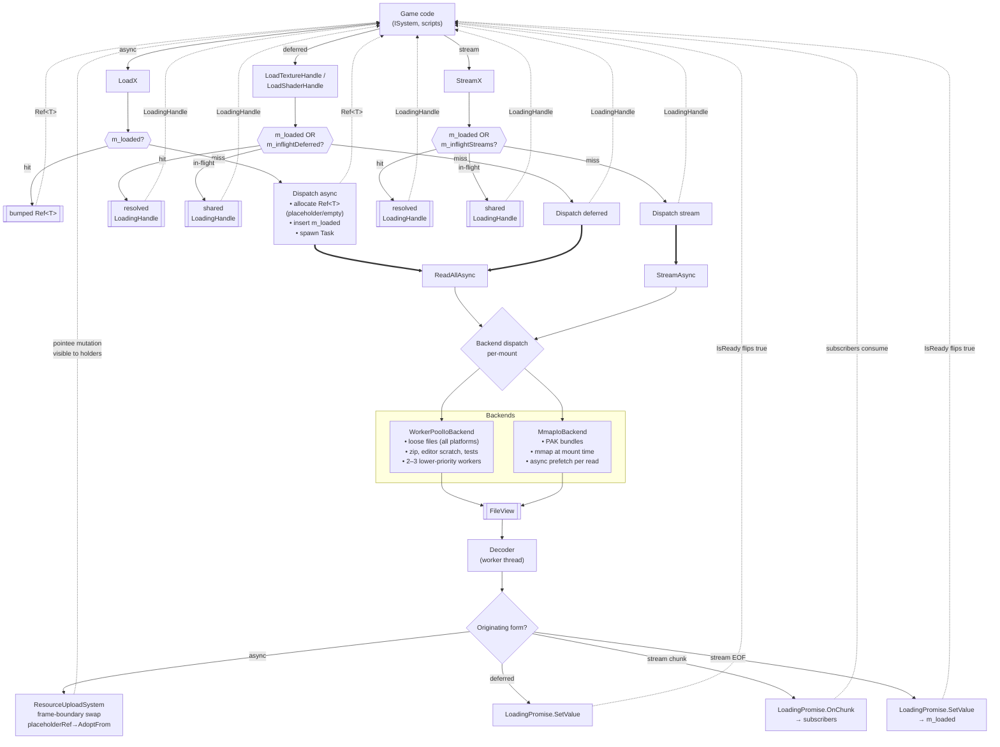

# Async Asset Loading — v1 Implementation Spec

This document is the v1 implementation contract for async asset loading in Hush. It is deliberately narrow: it covers exactly what ships in the first PRs, with no alternatives or rejected options. For design rationale, prior alternatives, and deferred features, see `docs/ideas/async-asset-loading.md`.

## Overview

Today all asset loads are synchronous, blocking the main thread on file I/O and decode. v1 delivers async, placeholder-backed loading (`LoadX`), progressive streaming (`StreamX`) for long audio and large scenes, and an mmap backend for the upcoming PAK bundle format — on top of the existing `Task<T>` coroutine infrastructure and `ResourceUploadSystem` deferred-upload pattern.

**What v1 includes:**

- `Task<FileView> VirtualFilesystem::ReadAllAsync(path, priority)`.
- `AsyncGenerator<FileView> VirtualFilesystem::StreamAsync(path, chunkSize, priority)`.
- `LoadX` methods (async form) returning `Ref<T>` with placeholder/empty-state → loaded swap at a render-thread sync point.
- `StreamX` methods returning `LoadingHandle<T>` for per-chunk subscription and a final resolution event.
- `LoadXAsync` coroutine forms (`Task<Ref<T>>`) for engine-internal code (cooker, editor preloader, custom background tasks).
- Two I/O backends, selected per-VFS-mount:
  - `WorkerPoolIoBackend` — loose files on every platform, zip archives, editor scratch, tests. A small (2–3 worker) lower-priority `ThreadPool` instance doing blocking `fread`.
  - `MmapIoBackend` — PAK-style cooked bundles. mmap at mount time, async prefetch per read.
- `ResourceManager` cache cleanup: thread-safety, path normalization, dispatch-time `Ref<T>` insertion, `Ref<T>::IsNull()` fast path.

**What v1 excludes** (see `async-asset-loading.md` Roadmap):

`IocpIoBackend` (and `io_uring`), `CancellationToken` parameter, per-priority byte budgets, byte-level gate coalescing, `LoadingSystem` auto-applier, `Task<T>` destructor cancellation, cache eviction policy, multi-consumer stream publish/subscribe.

**Why no IOCP in v1?** A dedicated 2–3 worker I/O pool covers the realistic load pattern for a game engine (bursty at level load, low during gameplay). Native async (IOCP / io_uring) pays off at sustained 100+ concurrent reads — not a Hush workload yet. `IIoBackend` is an interface, so `IocpIoBackend` is a drop-in addition later if profiling ever justifies it.

## Public API

### Enums

```cpp
enum class ELoadPriority        : std::uint8_t { Critical, Normal, Low };
enum class EPlaceholderBehavior : std::uint8_t { UsePlaceholder, NoPlaceholder };
```

### Async form — `LoadX`

Returns `Ref<T>` immediately. Pointee starts as a placeholder (if the asset type has one and the caller opts in) or in an empty state; swaps to loaded data atomically when ready. Callable from any `ISystem` hook, script, or plain function.

```cpp
Ref<TextureComponent> ResourceManager::LoadTexture(
    std::string_view     path,
    ELoadPriority        priority    = ELoadPriority::Normal,
    EPlaceholderBehavior placeholder = EPlaceholderBehavior::UsePlaceholder);

Ref<ShaderAsset> LoadShader(std::string_view path,
                            ELoadPriority priority = ELoadPriority::Normal);

Ref<MeshAsset>   LoadMesh (std::string_view path, ELoadPriority = ELoadPriority::Normal);
Ref<AudioClip>   LoadAudio(std::string_view path, ELoadPriority = ELoadPriority::Normal);
Ref<SceneAsset>  LoadScene(std::string_view path, ELoadPriority = ELoadPriority::Normal);
```

Per-asset placeholder policy:

| Asset               | Placeholder default         | Opt-out? | Empty state               |
|---------------------|-----------------------------|----------|---------------------------|
| `TextureComponent`  | checkerboard                | yes      | null `m_texture`          |
| `ShaderAsset`       | magenta error shader        | **no**   | —                         |
| `MeshAsset`         | none                        | —        | empty mesh                |
| `SceneAsset`        | none                        | —        | empty entities list       |
| `AudioClip`         | none                        | —        | empty sample data         |

`LoadScene` loads the scene **asset**. Activating a scene is separate: `engine->LoadScene(sceneAsset)`.

### Deferred form — `LoadingHandle<T>`

For callers that want "no `Ref<T>` until ready" on a non-streaming load.

```cpp
LoadingHandle<TextureComponent> LoadTextureHandle(
    std::string_view path, ELoadPriority = ELoadPriority::Normal);
LoadingHandle<ShaderAsset>      LoadShaderHandle(
    std::string_view path, ELoadPriority = ELoadPriority::Normal);
```

### Streaming form — `StreamX`

Returns `LoadingHandle<T>` with per-chunk subscription. Mandatory for long audio and large cooked scenes.

```cpp
LoadingHandle<AudioClip>        StreamAudioClip(std::string_view path, ELoadPriority = ELoadPriority::Normal);
LoadingHandle<SceneAsset>       StreamScene    (std::string_view path, ELoadPriority = ELoadPriority::Normal);
LoadingHandle<TextureComponent> StreamTexture  (std::string_view path, ELoadPriority = ELoadPriority::Normal);
LoadingHandle<MeshAsset>        StreamMesh     (std::string_view path, ELoadPriority = ELoadPriority::Normal);
```

### `LoadingHandle<T>`

```cpp
template <typename T>
class LoadingHandle
{
public:
    enum class EError { None, FileNotFound, InvalidFormat, DecodeFailed, IoError, Cancelled };

    bool   IsReady()  const noexcept;
    bool   IsFailed() const noexcept;
    EError GetError() const noexcept;

    void   Wait() const;               // blocks; not for ISystem hot path
    Ref<T> Take() const;               // precondition: IsReady()
    void   DropReference() noexcept;

    void   Cancel();                   // stop observing; load keeps running
    ~LoadingHandle() { Cancel(); }
};
```

Usage from `ISystem::OnUpdate`:
```cpp
if (m_handle.IsFailed()) { LogLoadError(m_handle.GetError()); return; }
if (!m_handle.IsReady()) return;
m_entity.GetComponent<TextureComponent>().SetTexture(m_handle.Take());
```

### Coroutine form — `LoadXAsync`

Usable only from coroutine contexts (cooker, importer, editor preloader, background `Task<>`s).

```cpp
Task<Ref<TextureComponent>> LoadTextureAsync(std::string_view path, ELoadPriority = ELoadPriority::Normal);
Task<Ref<MeshAsset>>        LoadMeshAsync  (...);
Task<Ref<ShaderAsset>>      LoadShaderAsync(...);
Task<Ref<AudioClip>>        LoadAudioAsync (...);
Task<Ref<SceneAsset>>       LoadSceneAsync (...);
```

### Filesystem primitives

```cpp
Task<FileView>           VirtualFilesystem::ReadAllAsync(std::string_view path,
                                                          ELoadPriority priority = ELoadPriority::Normal);

AsyncGenerator<FileView> VirtualFilesystem::StreamAsync (std::string_view path,
                                                          std::size_t    chunkSize,
                                                          ELoadPriority  priority = ELoadPriority::Normal);
```

## Architecture

Solid arrows are async data flow; dashed arrows are "returns immediately / visible effect" paths.



**Reading the diagram:**

- Three entry shapes, one dispatch pipeline. All hit the cache first; most calls short-circuit with no I/O.
- Two backends run concurrently (different mounts use different backends); `FileView` is the unifying choke point.
- Completion branches four ways: async→`AdoptFrom` swap, deferred→single promise set, stream chunk→subscriber callback, stream EOF→final promise set.

## Implementation Phases

### Phase A — `ResourceManager` cache prerequisites

Ships independently; has value even without async.

| # | Change | Files |
|---|---|---|
| A1 | Add `std::mutex m_cacheMutex` guarding `m_loadedResources`, `m_references`, `m_deletionQueue`. Lock all existing `Load*`, `IncreaseRefCount`, `DecreaseRefCount`, `FreePending`. | `ResourceManager.{hpp,cpp}` |
| A2 | Extend `AllocateRef<T>` to return `{ Ref<T>, bool inserted }`. Rewrite the inline cache logic in `LoadTexture` (`ResourceManager.cpp:64–71`, `140–143`) and `LoadMesh` onto the shared path. | `ResourceManager.{hpp,cpp}` |
| A3 | Add `VirtualFilesystem::NormalizePath(std::string_view) → std::string`. Canonicalize separators, strip `./`, resolve `../`, lowercase on Windows. Apply before hashing in every `LoadX`. | `VirtualFilesystem.{hpp,cpp}`, `ResourceManager.cpp` |
| A4 | Load tasks hold a strong `Ref<T>` for their full duration. Prevents ref-zero-during-load deletion. | `ResourceManager.cpp` |
| A5 | `Ref<T>` caches the `RefCounted*` at construction. `IsNull()` becomes `m_element == INVALID_HANDLE || m_refCounted->IsNull()` — removes the per-call map lookup. | `Ref.hpp` |

### Phase B — async file-read machinery

| # | Change | Files |
|---|---|---|
| B1 | `ELoadPriority` enum. | `src/engine_core/filesystem/src/LoadPriority.hpp` (new) |
| B2 | `IoRequestGate` — single-concurrency-cap-per-backend backlog, sorted by priority. Hook point for future byte-budget extensions. | `src/engine_core/filesystem/src/IoRequestGate.{hpp,cpp}` (new) |
| B3 | `FileView` with type-erased `IBackingData` (heap or mmap slice). | `src/engine_core/filesystem/src/FileView.{hpp,cpp}` (new) |
| B4 | `IIoBackend` interface: `Task<FileView> ReadAll(path, range, priority)` and `AsyncGenerator<FileView> Stream(path, chunkSize, priority)`. | `src/engine_core/filesystem/src/IIoBackend.hpp` (new) |
| B5 | `WorkerPoolIoBackend` — 2–3 worker lower-priority `ThreadPool` instance doing blocking `fread`. The only loose-file backend in v1. | `src/engine_core/filesystem/src/backends/WorkerPoolIoBackend.{hpp,cpp}` (new) |
| B6 | `MmapIoBackend` — mount-scoped. `mmap`/`MapViewOfFile` at mount time; `madvise(MADV_WILLNEED)`/`PrefetchVirtualMemory` on a worker per read; `FileView` is a non-owning slice. SIGBUS / `EXCEPTION_IN_PAGE_ERROR` handler surfaces as `Task<FileView>` exception. | `src/engine_core/filesystem/src/backends/MmapIoBackend.{hpp,cpp}` (new) |
| B7 | Each VFS mount carries its own `IIoBackend`. Path resolution picks the backend per mount. | `VirtualFilesystem.{hpp,cpp}` |
| B8 | `VirtualFilesystem::ReadAllAsync` dispatches through the gate to the mount's backend. | `VirtualFilesystem.{hpp,cpp}` |
| B9 | `AsyncGenerator<T>` coroutine type. `co_yield T; consumer co_await`s `Next()`. | `src/engine_core/threading/src/async/AsyncGenerator.hpp` (new) |
| B10 | Bounded MPSC channel for per-handle chunk delivery. | `src/engine_core/threading/src/async/BoundedMpscChannel.hpp` (new) |
| B11 | `IIoBackend::Stream` implementations on both backends. | Backend files above |
| B12 | `VirtualFilesystem::StreamAsync` dispatches through the gate. | `VirtualFilesystem.{hpp,cpp}` |

### Phase C — per-asset integration (async form)

| # | Change | Files |
|---|---|---|
| C1 | `Swappable<T>` concept + `AdoptFrom(T&&)` on `TextureComponent`, `ShaderAsset`, `MeshAsset`, `SceneAsset`, `AudioClip`. | `Swappable.hpp` (new) + per-asset headers |
| C2 | Placeholder catalogue: default checkerboard `TextureComponent`, magenta error `ShaderAsset`. Uploaded at startup. | `ResourceManager.cpp`, new `Placeholders.{hpp,cpp}` |
| C3 | Per-asset decode pipeline: `DecodeX(FileView) → T` (pure); `LoadXAsync(path) → Task<Ref<T>>` (cache-aware). | Per-asset loader files under `src/engine_core/resources/src/Loaders/` (new) |
| C4 | `LoadingHandle<T>` + `LoadingPromise<T>` — intrusive refcount, atomic state, inline `Ref<T>` storage, chunk-subscription callback list. | `src/engine_core/resources/src/LoadingHandle.hpp` (new) |
| C5 | `LoadAsyncWithPlaceholder<T>` helper (templated on loader callable). | `src/engine_core/resources/src/LoadAsyncHelpers.hpp` (new) |
| C6 | Sync `LoadX` methods — async form. Cache-aware; ~10 lines each. | `ResourceManager.{hpp,cpp}` |
| C7 | `LoadTextureHandle` / `LoadShaderHandle` for the deferred form. | `ResourceManager.{hpp,cpp}` |
| C8 | `ResourceUploadSystem` frame-boundary swap step — dequeues pending swaps (async-form + deferred/stream-form promise resolution) in one pass, calls `AdoptFrom` / `SetValue`. | `ResourceUploadSystem.{hpp,cpp}` |

### Phase D — streaming

| # | Change | Files |
|---|---|---|
| D1 | `LoadAsyncStream<T>` helper — routes chunk events to subscribers, final event to `SetValue`. | `LoadAsyncHelpers.hpp` |
| D2 | `m_inflightStreams: path → LoadingPromise<?>*` on `ResourceManager`, guarded by `m_cacheMutex`. | `ResourceManager.{hpp,cpp}` |
| D3 | Sync `StreamX` methods — `StreamAudioClip`, `StreamScene`, `StreamTexture`, `StreamMesh`. Cache-aware (`m_loaded` first, then `m_inflightStreams`). | `ResourceManager.{hpp,cpp}` |
| D4 | Binary scene format (v2): magic + version header, length-prefixed `[record_size: u32][record_type: u16][payload]` entity records, parent-link table. `SceneAsset` dispatches on magic bytes. | `SceneAsset.{hpp,cpp}`, new `SceneFormatV2.{hpp,cpp}` |
| D5 | `SceneStreamingSystem` (`ISystem`) — pops up to `instantiateBudgetPerFrame` records per frame, instantiates entities, runs the parent-link second pass on completion. | `src/engine_core/resources/src/Systems/SceneStreamingSystem.{hpp,cpp}` (new) |
| D6 | `AudioMixerSystem` stream subscription — consumes chunk events from `StreamAudioClip` handles, feeds the ring buffer, drives playback from `OnUpdate`. | `AudioMixerSystem.{hpp,cpp}` (existing or new) |

## Core Types

### `FileView`

```cpp
class FileView
{
    struct IBackingData { virtual ~IBackingData() = default; };

    struct HeapBackingData final : IBackingData
    {
        std::unique_ptr<std::byte[]> data;
        std::size_t                  size;
    };

    struct MmapSliceBackingData final : IBackingData
    {
        // No-op destructor — the mount owns the mapping.
    };

    std::unique_ptr<IBackingData> m_backingData;
    const std::byte              *m_data;
    std::size_t                   m_size;

public:
    std::span<const std::byte> GetData() const noexcept { return {m_data, m_size}; }
    std::size_t                GetSize() const noexcept { return m_size; }

    FileView(FileView&&) noexcept            = default;
    FileView &operator=(FileView&&) noexcept = default;
    FileView(const FileView&)                = delete;
    FileView &operator=(const FileView&)     = delete;
};
```

### `LoadingHandle<T>` / `LoadingPromise<T>`

Custom promise with intrusive refcount, matching the engine's `Ref<T>` / `RefCounted` style.

```cpp
template <typename T>
class LoadingPromise
{
public:
    enum class State : std::uint8_t { Pending, Ready, Failed, Cancelled };
    using EError = typename LoadingHandle<T>::EError;
    using ChunkCallback = std::function<void(FileView const&)>;  // subscribers on streams

    // Producer.
    void SetValue   (Ref<T> value) noexcept;
    void SetError   (EError err)   noexcept;
    void MarkCancelled()           noexcept;
    void FireChunk  (FileView const& chunk) noexcept;  // stream path only

    // Consumer.
    State  GetState() const noexcept;
    EError GetError() const noexcept;
    Ref<T> Take()           noexcept;  // precondition: Ready
    void   Wait()     const noexcept;  // futex on m_state

    void   Subscribe(ChunkCallback cb);  // stream path: register per-chunk observer

    // Intrusive refcount.
    void Retain()  noexcept;
    void Release() noexcept;

private:
    std::atomic<State>         m_state    = State::Pending;
    std::atomic<std::uint32_t> m_refcount = 1;
    alignas(Ref<T>) std::byte  m_storage[sizeof(Ref<T>)]{};
    EError                     m_error    = EError::None;
    std::vector<ChunkCallback> m_chunkSubscribers;   // stream path
    std::mutex                 m_subMutex;
};

template <typename T>
class LoadingHandle
{
public:
    enum class EError { None, FileNotFound, InvalidFormat, DecodeFailed, IoError, Cancelled };

    bool   IsReady()  const noexcept;
    bool   IsFailed() const noexcept;
    EError GetError() const noexcept;

    void   Wait() const;
    Ref<T> Take() const;   // precondition: IsReady()
    void   DropReference() noexcept;

    void   Subscribe(typename LoadingPromise<T>::ChunkCallback cb);  // streams only
    void   Cancel();
    ~LoadingHandle() { Cancel(); if (m_promise) m_promise->Release(); }

private:
    LoadingPromise<T> *m_promise = nullptr;
};
```

### `WorkerPoolIoBackend`

```cpp
class WorkerPoolIoBackend final : public IIoBackend
{
public:
    WorkerPoolIoBackend(int numWorkers = 3, ThreadPriority prio = ThreadPriority::BelowNormal)
        : m_pool(numWorkers, prio) {}

    Task<FileView> ReadAll(std::string_view path, Range range, ELoadPriority) override
    {
        co_return co_await SpawnOn(m_pool, [p = std::string(path), range] {
            std::FILE *f = std::fopen(p.c_str(), "rb");
            if (!f) throw std::system_error(errno, std::generic_category(), "fopen");

            std::fseek(f, 0, SEEK_END);
            std::size_t size = range.length
                ? range.length
                : static_cast<std::size_t>(std::ftell(f));
            std::fseek(f, static_cast<long>(range.offset), SEEK_SET);

            auto buf = std::make_unique<std::byte[]>(size);
            std::fread(buf.get(), 1, size, f);
            std::fclose(f);

            return MakeHeapView(std::move(buf), size);
        });
    }

    AsyncGenerator<FileView> Stream(std::string_view path, std::size_t chunkSize, ELoadPriority) override
    {
        // Sequential fread loop on a worker, yielding one FileView per chunk.
        // Backpressure comes from the consumer awaiting Next() before the next read is issued.
    }

private:
    ThreadPool m_pool;   // 2–3 workers, lower-priority, dedicated to I/O
};
```

Key properties: a **dedicated** pool so bursts of asset loads cannot drain the main compute `ThreadPool`; lower thread priority so the OS preempts these workers for compute when the game needs cycles; simple enough to unit-test without platform mocks.

### `MmapIoBackend`

```cpp
class MmapIoBackend final : public IIoBackend
{
public:
    MmapIoBackend(std::filesystem::path bundlePath, ThreadPool &mainPool);
    ~MmapIoBackend() override;   // munmap / UnmapViewOfFile + close handles

    Task<FileView> ReadAll(std::string_view path, Range range, ELoadPriority) override
    {
        // Path → TOC lookup elided. Assume range resolved to (offset, length) into m_base.
        const std::byte  *ptr = m_base + range.offset;
        const std::size_t n   = range.length;

        co_await SpawnOn(m_mainPool, [ptr, n]() noexcept {
#ifdef _WIN32
            WIN32_MEMORY_RANGE_ENTRY entry{ const_cast<std::byte*>(ptr), n };
            ::PrefetchVirtualMemory(::GetCurrentProcess(), 1, &entry, 0);
#else
            ::madvise(const_cast<std::byte*>(ptr), n, MADV_WILLNEED);
#endif
        });

        co_return MakeMmapSliceView(ptr, n);
    }

    AsyncGenerator<FileView> Stream(std::string_view path, std::size_t chunkSize, ELoadPriority) override;

private:
    ThreadPool       &m_mainPool;
    const std::byte  *m_base = nullptr;
    std::size_t       m_size = 0;
#ifdef _WIN32
    HANDLE m_fileHandle    = nullptr;
    HANDLE m_mappingHandle = nullptr;
#else
    int    m_fd = -1;
#endif
};
```

Key properties: mapping lives for the mount's lifetime; reads are pointer-arithmetic slices; async-ness comes from the prefetch, not the mmap itself; `FileView` destructor is a no-op (mount owns the mapping).

### Swap helper

```cpp
template <typename T>
concept Swappable = requires(T &a, T &&b) {
    { a.AdoptFrom(std::move(b)) } -> std::same_as<void>;
};

template <Swappable T, typename LoaderFn>
    requires std::invocable<LoaderFn> &&
             std::same_as<std::invoke_result_t<LoaderFn>, Task<T>>
Ref<T> LoadAsyncWithPlaceholder(
    ResourceManager &mgr,
    Ref<T>           alreadyCachedRef,   // placeholder- or empty-initialized, already in m_loaded
    LoaderFn         loader,
    ELoadPriority    priority = ELoadPriority::Normal)
{
    SpawnOn(mgr.GetThreadPool(),
        [strongRef     = alreadyCachedRef,
         loader        = std::move(loader),
         &uploadSystem = mgr.GetUploadSystem()]() mutable -> Task<>
        {
            T loaded = co_await loader();
            uploadSystem.QueueSwap(strongRef, std::move(loaded));
        });
    return alreadyCachedRef;
}

// Per-asset loader (cache-aware):
Ref<TextureComponent> ResourceManager::LoadTexture(
    std::string_view path, ELoadPriority prio, EPlaceholderBehavior ph)
{
    if (auto hit = LookupLoaded<TextureComponent>(path)) return *hit;

    TextureComponent *fresh = (ph == EPlaceholderBehavior::UsePlaceholder)
        ? NewFromPlaceholder<TextureComponent>(GetDefaultPlaceholderTexture())
        : NewEmpty<TextureComponent>();
    Ref<TextureComponent> ref = InsertLoaded<TextureComponent>(path, fresh);

    return LoadAsyncWithPlaceholder<TextureComponent>(
        *this, ref,
        [this, p = std::string(path), prio]() -> Task<TextureComponent> {
            FileView bytes = co_await m_filesystem->ReadAllAsync(p, prio);
            co_return DecodeTexture(bytes);
        });
}

// AdoptFrom on the pointee:
void TextureComponent::AdoptFrom(TextureComponent &&other)
{
    m_texture  = std::exchange(other.m_texture,  nullptr);
    m_cpuImage = std::exchange(other.m_cpuImage, {});
    m_format   = other.m_format;
}
```

## Acceptance Criteria

Phase-by-phase acceptance. Each phase is shippable on its own merit.

### Phase A

- Thread-safety test: 8 threads × 10 s tight `LoadTexture(samePath)` loop → exactly one `TextureComponent` allocated, no duplicate `m_loadedResources` entries, no crashes under TSan.
- `LoadTexture` routes through `AllocateRef<T>`; no inline lookup blocks remain in `ResourceManager.cpp`.
- `mgr.LoadTexture("x.png")` and `mgr.LoadTexture("./x.png")` return the same underlying pointee.
- Ref-zero-during-load test: drop game-side `Ref`s mid-load → pointee survives until load completes, then deleted next `FreePending`.
- `Ref<T>::IsNull()` microbench shows the map lookup removed.
- Existing editor smoke test passes: open editor, load a scene, textures render.

### Phase B

- `ReadAllAsync` returns bytes equal to a synchronous `fopen`/`fread` of the same file.
- `StreamAsync` yields chunks whose concatenation equals the full file.
- Each backend passes the above against its own mount type.
- `WorkerPoolIoBackend` thread-priority: workers observably run at below-normal priority (smoke-test via `Thread.Priority` / `pthread_getschedparam`).
- `WorkerPoolIoBackend` shutdown test: destroy under concurrent in-flight reads → all pending awaiters resume cleanly; no leaked threads.
- `MmapIoBackend` test: mount a file > 4 MiB, read two non-overlapping ranges concurrently → both reads land correctly, no data races, prefetch workers completed before `Task<FileView>` resolved.
- Gate test: set concurrency cap = 1 on WorkerPool; issue 4 concurrent reads → observed max in-flight = 1 at any moment.

### Phase C

- `Ref<TextureComponent> a = mgr.LoadTexture(p); Ref<TextureComponent> b = mgr.LoadTexture(p);` — both point at placeholder; after `ResourceUploadSystem` processes the swap queue, both point at the real texture (a single `AdoptFrom` affects both).
- Placeholder catalogue: default checkerboard and magenta error shader visible in debug UI asset browser.
- `LoadTextureHandle` — `IsReady()` returns false until load completes, then true; `Take()` returns a valid `Ref`.
- `LoadXAsync` coroutine form: `co_await mgr.LoadTextureAsync(p)` in a test task yields the same `Ref` as the sync form would after swap.

### Phase D

- `StreamAudioClip` test: mock audio file → `SceneStreamingSystem`-equivalent test harness receives chunks in order, concatenation matches the file.
- `StreamScene` test: cooked binary scene v2 with 1,000 entities → `SceneStreamingSystem` instantiates all entities across multiple frames, respects `instantiateBudgetPerFrame`, parent links resolved on completion.
- Two concurrent `StreamAudioClip(same path)` → shared `LoadingPromise`, both handles receive every chunk, both `Take()` return the same `Ref` after EOF.
- Cancellation: drop all handles mid-stream → producer observes subscriber count drop to zero on its next chunk submit and stops reading (best-effort, not guaranteed synchronous).

## Files Referenced

- `src/engine_core/filesystem/src/IFile.hpp` — `TODO: async interfaces.` at line 84; `Read(std::size_t) → Result<std::span<std::byte>>` mmap-friendly overload at line 126.
- `src/engine_core/filesystem/src/VirtualFilesystem.{hpp,cpp}` — gains `ReadAllAsync`, `StreamAsync`, `NormalizePath`, per-mount `IIoBackend` machinery.
- `src/engine_core/threading/src/async/Task.hpp` — existing `Task<T>` + awaiter contract.
- `src/engine_core/threading/src/async/{SyncWait,WhenAll,SelfDeleteTask}.hpp` — existing coroutine utilities.
- `src/engine_core/threading/src/executors/ThreadPool.{hpp,cpp}` — the main compute pool; a separate 2–3 worker `ThreadPool` instance (lower-priority) underlies `WorkerPoolIoBackend`.
- `src/engine_core/resources/src/Ref.hpp` — `IsNull()` fast-path optimization target.
- `src/engine_core/resources/src/IResourceManager.hpp` — `RefCounted` intrusive-refcount pattern; `LoadingPromise` mirrors it.
- `src/engine_core/resources/src/ResourceManager.{hpp,cpp}` — cache cleanup target; `AllocateRef<T>` extension; new sync `LoadX` / `LoadXHandle` / `StreamX` methods.
- `src/engine_core/resources/src/ResourceUploadSystem.{hpp,cpp}` — extended with the frame-boundary swap step.
- `src/engine_core/resources/src/TextureComponent.hpp` — `AdoptFrom` target (GPU handle + CPU image fields).
- `src/engine_core/core/src/ISystem.hpp` — user-system constraint (sync hooks only).
- `docs/ideas/async-asset-loading.md` — full design doc with alternatives, rationale, and roadmap.
- `docs/ideas/scene-system-design.md` — sibling scene format design; binary v2 cross-references it.
