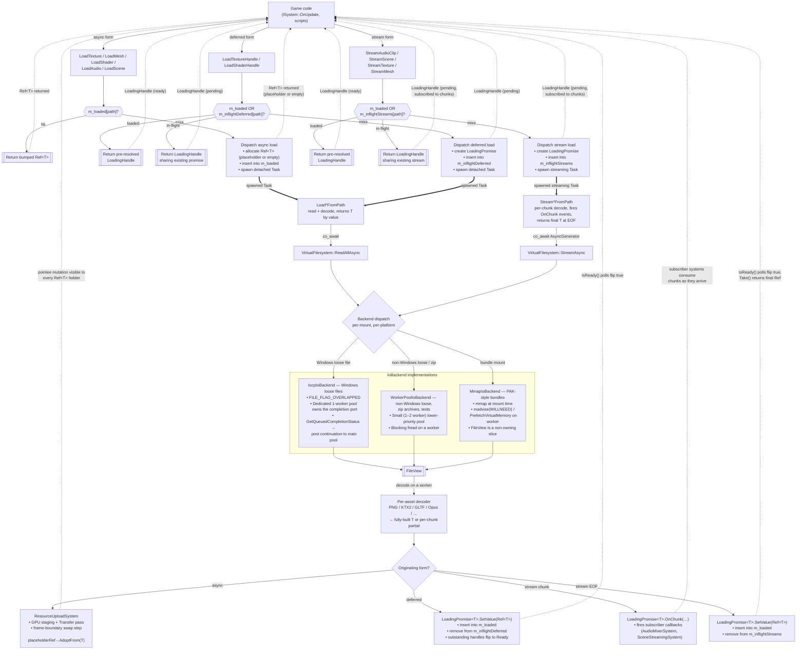

# Async Asset Loading Design (v1)

## Context

Today, all asset loads in the engine run synchronously on the calling thread. `ResourceManager::LoadTexture` opens the file via `VirtualFilesystem::OpenFile` (`src/engine_core/filesystem/src/VirtualFilesystem.hpp`), reads bytes with C-style `fread` through `CFileSystem`, and decodes inline. The `IFile` interface explicitly notes `TODO: async interfaces.` (`src/engine_core/filesystem/src/IFile.hpp:84`). Main thread is blocked for the full duration of I/O + decode.

Meanwhile, the threading layer already ships mature coroutine infrastructure — `Task<T>` (`src/engine_core/threading/src/async/Task.hpp`), `SyncWait`, `WhenAll`, `SelfDeleteTask`, a `ThreadPool` with work-stealing queues (`src/engine_core/threading/src/executors/ThreadPool.hpp`), and a `TaskOperation` awaiter. None of it is used by the loader. The existing `ResourceUploadSystem` already defers GPU uploads to a render-thread Transfer pass, so there is already a render-side deferral boundary to hook into.

**All of Hush asset loading should be async-first, fast-returning, with optional placeholders.** This v1 lands the essentials; streaming, cancellation tokens, and more aggressive I/O shaping are explicitly deferred — see the Roadmap at the end.

### v1 scope

In:

- Coroutine-based async file reads (`Task<FileView> ReadAllAsync`) **and** streaming reads (`AsyncGenerator<FileView> StreamAsync`).
- `LoadX` loaders that return `Ref<T>` **immediately**, backed by a placeholder (textures, shaders) or an empty-state pointee (meshes, scenes, audio samples) that is swapped to the real data when the load completes.
- `StreamX` loaders that return `LoadingHandle<T>` for progressive delivery — **mandatory for long audio (music, ambient) and large scene loads**. Chunks arrive over time; engine systems subscribe to per-chunk events.
- `LoadingHandle<T>` for opt-out-of-placeholder loads AND as the return type for streaming loads.
- Three backends, selected per-VFS-mount:
  - **`IocpIoBackend`** (Windows primary) — `FILE_FLAG_OVERLAPPED` + completion port + dedicated-1-worker completion pool.
  - **`WorkerPoolIoBackend`** — cross-platform fallback, also used by zip/archive mounts. A small (1–2 worker) lower-priority `ThreadPool` instance doing blocking `fread`.
  - **`MmapIoBackend`** — the PAK-format backend. Mmap at mount time, async prefetch on read. Streaming over mmap is natively zero-copy (a sequence of range slices).
- `FileView` as a non-owning, lifetime-tied byte view that unifies heap-buffer and mmap backings.
- `AsyncGenerator<T>` coroutine type — one `co_yield` per chunk, consumer `co_await`s `Next()`.
- `ResourceManager` cache cleanup: thread-safety, path normalization, dispatch-time `Ref<T>` insertion for placeholder-form loads.
- `ELoadPriority` enum — plumbed through the API and to the backends, used as a simple per-backend request queue order (no per-priority byte-budget shaping in v1).
- Binary scene format (v2) with length-prefixed records — required for `StreamScene` chunked parsing. JSON scenes stay supported for small/editor scenes through the async form.
- `SceneStreamingSystem` (`ISystem`) that drives `StreamScene` handles and instantiates entities incrementally.
- `AudioMixerSystem` integration that subscribes to `StreamAudioClip` handles and feeds the ring buffer from chunks as they arrive.

Out (see Roadmap):

- `CancellationToken` parameter on async loads — handle-drop is sufficient "cancellation" in v1.
- Per-priority concurrent-read budgets and per-frame byte budgets. The gate is a simple backlog sorted by priority, not a budget engine.
- Request coalescing at the byte layer. `ResourceManager` cache-level dedup covers the same concurrent-path case.
- `io_uring` backend (Linux) — waits for Linux CI to land.
- `LoadingSystem` ISystem auto-applier — nice-to-have once the core works.

### Relationship to existing `IFileSystem` / `IFile`

**This design does not drop `IFileSystem` or `IFile`.** The existing interfaces stay in place for:

- Directory listing and metadata queries (`IFile::GetFileInfo`, path iteration).
- Write operations — config save, screenshot output, cooker output, editor save-as.
- Stream-style reads with `Seek` — anything that does not fit in memory, or needs random access without mapping the whole file.
- Non-`CFileSystem` VFS implementations (zip archives, packed formats, potential network VFS). These will not get an IOCP path; they use the `WorkerPoolIoBackend` through the async façade, or stay on the legacy sync path.

What this design replaces is **one specific hot path**: "open this asset file, read it entirely into memory, decode it, release the file." That is a large majority of asset loads by frequency, but a tiny fraction of the filesystem surface by capability.

Concretely:

- `VirtualFilesystem` *grows* a new method `ReadAllAsync(path, priority) -> Task<FileView>`. It does not remove `OpenFile`.
- `IIoBackend` is a sibling layer, not a replacement for `IFileSystem`. Each mount carries its own `IIoBackend`.
- Loader call sites inside `ResourceManager` migrate from `OpenFile`+`Read` to `ReadAllAsync`. Non-loader call sites (editor, tools, write paths) are untouched.

### Constraint: user systems are synchronous

`ISystem` (`src/engine_core/core/src/ISystem.hpp`) lifecycle hooks all return `void`; they cannot `co_await`. User code must call `LoadX` returning `Ref<T>` or `LoadingHandle<T>` — both yield in the same frame. The `LoadXAsync` coroutine forms exist and are exposed, but only usable from code that is itself running as a coroutine (cooker, importer, background `Task<>` spawned explicitly by game code).

Users never pass their own placeholders — they choose *whether* to have one (via `EPlaceholderBehavior`), not *what* it looks like. The engine owns the placeholder catalogue.

## Target API

### Async loader API — `LoadX` (the common path)

Every `LoadX` returns a `Ref<T>` immediately. The pointee starts as a placeholder (if applicable and chosen) or in an empty state, and is swapped atomically when the load completes. Callable from any `ISystem` hook / script / plain function.

```cpp
enum class ELoadPriority        : std::uint8_t { Critical, Normal, Low };
enum class EPlaceholderBehavior : std::uint8_t { UsePlaceholder, NoPlaceholder };

Ref<TextureComponent> ResourceManager::LoadTexture(
    std::string_view     path,
    ELoadPriority        priority    = ELoadPriority::Normal,
    EPlaceholderBehavior placeholder = EPlaceholderBehavior::UsePlaceholder);

// Shaders: placeholder (magenta error shader) is mandatory. No opt-out.
Ref<ShaderAsset> LoadShader(std::string_view path,
                            ELoadPriority priority = ELoadPriority::Normal);

// Meshes / scenes / audio samples: no placeholder; pointee starts empty.
Ref<MeshAsset>   LoadMesh (std::string_view path, ELoadPriority = ELoadPriority::Normal);
Ref<AudioClip>   LoadAudio(std::string_view path, ELoadPriority = ELoadPriority::Normal);

// LoadScene loads the scene *asset*. Activation is separate:
// engine->LoadScene(sceneAsset) makes a scene active.
Ref<SceneAsset>  LoadScene(std::string_view path, ELoadPriority = ELoadPriority::Normal);
```

Per-asset policy:

| Asset               | Placeholder default         | Opt-out via `EPlaceholderBehavior`? | Empty state          |
|---------------------|-----------------------------|-------------------------------------|----------------------|
| `TextureComponent`  | checkerboard (configurable) | Yes                                 | null `m_texture` — renderer skips |
| `ShaderAsset`       | magenta error shader        | **No** (mandatory)                  | n/a                  |
| `MeshAsset`         | none                        | n/a                                 | empty mesh — renderer skips |
| `SceneAsset`        | none                        | n/a                                 | empty entities list  |
| `AudioClip` sample  | none                        | n/a                                 | empty sample data    |

### Streaming loader API — `StreamX` (mandatory for long audio and large scenes)

Streaming is not optional in v1. Long music tracks can't sit decoded in memory as a single blob, and a 10,000-entity scene can't instantiate in one frame without a visible hitch. Both cases produce results progressively, one chunk at a time.

```cpp
// Long music / ambient. Short SFX use the synchronous LoadAudio above.
LoadingHandle<AudioClip>    StreamAudioClip(std::string_view path,
                                            ELoadPriority priority = ELoadPriority::Normal);

// Large cooked scenes. Critical path for engine->LoadSceneAsync.
LoadingHandle<SceneAsset>   StreamScene    (std::string_view path,
                                            ELoadPriority priority = ELoadPriority::Normal);

// Also available for completeness, though virtual/tiled textures are the main
// future use case. Short textures are fine through LoadTexture.
LoadingHandle<TextureComponent> StreamTexture(std::string_view path,
                                              ELoadPriority priority = ELoadPriority::Normal);

// Meshes: allowed but rarely needed in v1. Reserved for LOD / streamed-geometry workflows.
LoadingHandle<MeshAsset>    StreamMesh     (std::string_view path,
                                            ELoadPriority priority = ELoadPriority::Normal);
```

The returned `LoadingHandle<T>` exposes chunk-level progress; engine-owned subsystems (`AudioMixerSystem`, `SceneStreamingSystem`) subscribe to per-chunk events via the handle. `Take()` returns a `Ref<T>` only once the stream completes. See the "Streaming Loads" section for the full design (binary scene format, chunk-boundary alignment, audio mixer integration).

### Deferred form — `LoadingHandle<T>` for opt-out-of-placeholder

For callers that want "no `Ref<T>` until ready" on a *non-streaming* load — UI that should pop in atomically, cases where an empty-state renderer branch is unacceptable. Small surface; returns the same `LoadingHandle<T>` type as the streaming API.

```cpp
template <typename T>
class LoadingHandle
{
public:
    enum class EError { None, FileNotFound, InvalidFormat, DecodeFailed, IoError, Cancelled };

    bool   IsReady()  const noexcept;
    bool   IsFailed() const noexcept;
    EError GetError() const noexcept;

    void   Wait() const;                 // block — NOT for ISystem hot path
    Ref<T> Take() const;                 // precondition: IsReady()
    void   DropReference() noexcept;

    void   Cancel();                     // stops observing the result; load keeps running
    ~LoadingHandle() { Cancel(); }
};

// Opt-out variants for asset types whose async form returns a placeholder-backed Ref.
LoadingHandle<TextureComponent> LoadTextureHandle(std::string_view, ELoadPriority = ELoadPriority::Normal);
LoadingHandle<ShaderAsset>      LoadShaderHandle (std::string_view, ELoadPriority = ELoadPriority::Normal);
```

Note: mesh / scene / audio do not need a `LoadingHandle` entry point because the async form already returns a `Ref<T>` pointing at empty state that behaves identically to "not yet loaded." If a concrete use case later demands the handle form for them, add it then.

Typical poll pattern from `ISystem::OnUpdate`:
```cpp
void MyLoadingSystem::OnUpdate(float dt)
{
    if (m_handle.IsFailed()) { LogLoadError(m_handle.GetError()); return; }
    if (!m_handle.IsReady()) return;
    m_entity.GetComponent<TextureComponent>().SetTexture(m_handle.Take());
}
```

### Coroutine API — `LoadXAsync`

Exposed but only usable from coroutine contexts — cooker, importer, background `Task<>`s explicitly spawned by game code, the editor preloader.

Cache-aware: returns `Ref<T>`. Duplicate concurrent requests for the same path share one read + one decode + one constructed object. Failures surface through the `Task<T>` exception channel.

```cpp
Task<Ref<TextureComponent>> LoadTextureAsync(std::string_view path, ELoadPriority = ELoadPriority::Normal);
Task<Ref<MeshAsset>>        LoadMeshAsync  (...);
Task<Ref<ShaderAsset>>      LoadShaderAsync(...);
Task<Ref<AudioClip>>        LoadAudioAsync (...);
Task<Ref<SceneAsset>>       LoadSceneAsync (...);
```

### Filesystem primitive

```cpp
Task<FileView> VirtualFilesystem::ReadAllAsync(
    std::string_view path,
    ELoadPriority    priority = ELoadPriority::Normal);
```

### `FileView` — non-owning view with backend-owned lifetime

```cpp
class FileView
{
public:
    std::span<const std::byte> GetData() const noexcept;
    std::size_t                GetSize() const noexcept;

    FileView(FileView &&) noexcept;
    FileView &operator=(FileView &&) noexcept;
    FileView(const FileView &)            = delete;
    FileView &operator=(const FileView &) = delete;
    ~FileView();   // releases backing: frees heap buffer, or no-op for mmap slice

private:
    struct IBackingData;
    std::unique_ptr<IBackingData> m_backingData;
    const std::byte              *m_data;
    std::size_t                   m_size;
};
```

Callers see `std::span<const std::byte>` regardless of backend. The destructor dispatches through `IBackingData` — `free` for heap-backed views, no-op for mmap slices (the mount owns the mapping). One virtual call at destruction, nothing on the hot path.

## Deduplication and the `ResourceManager` cache

A naive `LoadTexture("x.png")` that spawns a fresh read+decode on every call would re-read, re-decode, and construct a new `TextureComponent` per caller. Dedup happens at the `ResourceManager` layer.

### Existing cache: what's there, what's missing

Current state (`src/engine_core/resources/src/ResourceManager.hpp`):

**Already there:**
- `m_loadedResources: unordered_map<uint64_t, HandleId>` (line 126) — path hash → opaque asset handle. Keyed by `Hashing::Fnv1a64(path)`.
- `m_references: unordered_map<HandleId, RefCounted>` (line 124) — handle → atomic refcount + deleter. `RefCounted` at `IResourceManager.hpp:19–31` is already the right shape.
- `m_deletionQueue` (line 125) + `FreePending()` (`.cpp:50–59`) — deferred deletion, drained once per frame.
- `AllocateRef<T>(identifier, args...)` template (lines 105–121) — generic "lookup by hash; construct + insert on miss; return `Ref<T>`." Prior art.
- `Ref<T>` copy-constructor refcount bump (`Ref.hpp:50–55`). Multiple callers already share one asset correctly.

**Missing / broken for async:**
- **No locking.** Plain `unordered_map`/`vector` with no mutex. Background dispatch races with the main thread.
- **`LoadTexture` duplicates the cache-lookup inline** (`ResourceManager.cpp:64–71`, `140–143`) instead of using `AllocateRef<T>`.
- **No dispatch-time insertion.** Cache is populated only after decode completes. Placeholder-form loads need to insert a placeholder-backed `Ref<T>` *before* I/O begins.
- **No path normalization.** `"x.png"` and `"./x.png"` hash to distinct keys.
- **Ref-zero can delete mid-load** (`.cpp:38–41`). If game-side `Ref`s drop while the load is in flight, the pointee is enqueued for deletion under the task.
- **`Ref<T>::IsNull()` does a map lookup** on every call (`Ref.hpp:42–46`).
- **No `LoadingHandle` / `LoadingPromise` infrastructure.**

### What v1 adds

- `std::mutex m_cacheMutex` guarding the three maps.
- Path normalization (`VirtualFilesystem::NormalizePath`) applied before hashing.
- Extended `AllocateRef<T>` that returns "was inserted" so `LoadX` can branch on cache hit vs. miss (or splits into `LookupRef<T>` / `InsertPlaceholderBacked<T>`).
- Load tasks hold a strong `Ref<T>` for their full duration, preventing ref-zero-during-load deletion.
- `Ref<T>` caches the `RefCounted*` at construction to remove the map lookup from `IsNull()`.
- New helpers: `LookupLoaded<T>(path)`, `InsertPlaceholderBacked<T>(path, T*)`, `LookupOrRegisterInflight<T>(path)` (for the `LoadingHandle` deferred form).

### Dispatch logic

**Async form** (`LoadTexture`, `LoadMesh`, `LoadShader`, `LoadAudio`, `LoadScene`):
1. Check `m_loaded[path]` — hit? Return bumped `Ref<T>`.
2. Miss: allocate pointee (placeholder-initialized if `EPlaceholderBehavior::UsePlaceholder` and the type has one; otherwise empty state). Wrap in `Ref<T>`, insert into `m_loaded[path]`, return.
3. In parallel: spawn the detached decode task. On completion, `ResourceUploadSystem.QueueSwap(cachedRef, std::move(decoded))` runs `AdoptFrom` on the pointee. Every holder of `Ref<T>` sees the mutation.
4. A concurrent second caller during step 3 lands on step 1 and gets the same placeholder-pointing `Ref<T>`. The single swap updates both simultaneously.

**Deferred form** (`LoadTextureHandle`, `LoadShaderHandle`):
1. Check `m_loaded[path]` — hit? Return pre-resolved `LoadingHandle<T>`.
2. Check `m_inflightDeferred[path]` — hit? Return new `LoadingHandle<T>` sharing the existing `LoadingPromise<T>`.
3. Miss on both: create `LoadingPromise<T>`, insert into `m_inflightDeferred[path]`, spawn decode task. On completion: allocate `Ref<T>`, insert into `m_loaded`, set promise value, remove from `m_inflightDeferred`.

**Coroutine form** (`LoadXAsync`):
- Same as the async form but `co_await`s completion and returns the `Ref<T>` directly. Shares the cache.

## Architecture

Solid arrows are async data flow; dashed arrows are "returns immediately / visible effect" paths.



### Reading the diagram

- **Three entry shapes converge on the same backends.** `Game` uses `LoadX` (`Ref<T>` immediately), the handle form (`LoadingHandle<T>` for opt-out-of-placeholder), or `StreamX` (`LoadingHandle<T>` with chunk-by-chunk delivery). All three hit the cache first — 8 of 9 cache outcomes short-circuit without spawning a task.
- **Three backends run concurrently** in the same process. `bundle://` → `MmapIoBackend`, `res://` on Windows → `IocpIoBackend`, everything else → `WorkerPoolIoBackend`. Per-mount, not per-platform. All three support both `ReadAllAsync` and `StreamAsync`.
- **`FileView` is the unifying choke point.** After it, no downstream code knows or cares where the bytes came from — heap buffer vs. mmap slice is transparent.
- **Three completion paths, one decoder.** The async path mutates the cached pointee via `ResourceUploadSystem`. The deferred path resolves a `LoadingPromise` once. The stream path fires per-chunk subscriber callbacks and a final completion event. All become visible on the game's next frame / next poll.

## Key Design Decisions

**Why IOCP on Windows from day one, not threadpool-with-`fread` everywhere first.**
Windows is the only CI-tested platform, so the performant path should ship on the platform that is actually validated. IOCP is the most mature of the native async-file primitives — `OVERLAPPED` + completion ports has decades of reference material — and the non-Windows `WorkerPoolIoBackend` is a genuinely cheap backend (tens of lines) because its only job is blocking `fread`.

**Why the IOCP backend uses a second `ThreadPool` instance with one dedicated worker, not a bespoke I/O thread class.**
The existing `ThreadPool` is already the right abstraction — workers, a queue, a `TaskOperation` awaiter. Constructing a second instance with `num_workers = 1` gives a thread whose only work is `GetQueuedCompletionStatus()` in a loop, isolated from compute workers. Upsides over a bespoke class: same lifecycle and shutdown story, Tracy/profiler instrumentation already in place, trivial to resize later. The completion worker never runs coroutine continuations itself — on a completion, it posts the continuation back to the main `ThreadPool` and returns to polling.

**Why mmap is in v1 (not deferred), and why it is always wrapped by an async worker.**
PAK-like asset bundles are arriving soon; mmap is the right primitive for them (zero-copy reads, kernel page cache as asset cache, shared across processes). mmap itself is cheap but page-faults on cold pages would stall the touching thread. Every mmap-backed `ReadAllAsync(range)` schedules `madvise(MADV_WILLNEED)` / `PrefetchVirtualMemory` on a worker and resolves the `Task<FileView>` only after prefetch. Main thread never page-faults on cold bundle data.

**Why per-mount backend selection.**
Different storage shapes want different primitives. Bundles want mmap; loose files want kernel async (Windows) or worker-pool (everywhere else); zip/network mounts want the worker pool. Forcing one backend everywhere sacrifices either zero-copy or transform-friendliness. `VirtualFilesystem` already does mount-based path resolution; each mount carries its own `IIoBackend`.

| Storage shape                               | Windows              | Linux / macOS / Emscripten         |
|---------------------------------------------|----------------------|------------------------------------|
| Cooked contiguous bundle (PAK)              | `MmapIoBackend`      | `MmapIoBackend`                    |
| Loose files                                 | `IocpIoBackend`      | `WorkerPoolIoBackend`              |
| Zip archives                                | `WorkerPoolIoBackend`| `WorkerPoolIoBackend`              |
| Hot-reload / editor scratch                 | `WorkerPoolIoBackend`| `WorkerPoolIoBackend`              |

Hot-reload deliberately uses the worker pool rather than IOCP — mmap (not applicable here) risks `SIGBUS` on file change under it, and pinning buffers during OVERLAPPED reads complicates in-flight file replacement. Hot-reload is editor-only; performance doesn't matter.

**Why `FileView` is the shared return type.**
mmap hands out raw pointers into a kernel mapping; heap-buffer backends hand out pointers into allocated memory. A non-owning view with backend-owned lifetime unifies both. Callers get `span<const std::byte>` regardless; destructor dispatches through a type-erased backing — `munmap` / `UnmapViewOfFile` (not needed for slices; the mount owns the mapping) vs. `free`. No decoder branches on backend.

**Why the swap lives inside the pointee, not by rebinding `Ref<T>`.**
`Ref<T>` (`Ref.hpp`) is non-intrusive and handle-keyed — the `HandleId → IResourceManager*` binding is fixed at construction, and the manager owns the resource lifetime. Rebinding is hostile to that model. The pointee is mutable. All 100 holders of `Ref<TextureComponent>` already point at the same `TextureComponent`; an `AdoptFrom(T&&)` on that component is visible to every holder for free, zero `Ref<T>` changes.

**Why a generic `LoadAsyncWithPlaceholder<T>` helper, not per-asset glue.**
Every asset type wants the identical pattern: allocate with placeholder/empty → spawn load → queue swap when ready. Writing it five times and again per future asset type is copy-paste of non-trivial plumbing. One helper with a `Swappable<T>` concept centralizes the contract with `ResourceUploadSystem` and shrinks each `LoadX` to a few lines.

**Why the render-thread sync point, not atomics.**
`ResourceUploadSystem` already runs at a frame boundary and owns the contract for GPU staging. Extending it to call `AdoptFrom` at the boundary keeps the render hot path lock-free and atomics-free. Atomic pointers in `TextureComponent::m_texture` would add synchronization to every draw-call read for no benefit — frame-boundary is strictly coarser than draw-call granularity.

**Why meshes / scenes / audio samples have no placeholder, and how "empty state" differs from "no `Ref<T>` at all."**
A placeholder communicates "this is still loading / missing" in a useful way. A checkerboard does that; an "empty mesh" doesn't — it's visually identical to no-mesh-assigned. Instead of a visual sentinel, the async form returns a `Ref<T>` pointing at an **empty-state pointee** (empty mesh, empty entity list, null sample buffer). The `Ref<T>` is always valid; the data is what's empty. Renderers/mixers naturally skip empty state with a null/zero-size check they already do. Swap to real data is atomic at completion.

**Why the placeholder is a per-call `EPlaceholderBehavior` parameter, not a separate method.**
Rendering the magenta checkerboard surfaces missing/slow assets during development — the right default. UI / menus / cinematics sometimes want "show nothing" instead. Rather than split into two methods, the single parameter exposes the choice inline. Predictable across every asset type that has placeholders; keeps the engine in control of the placeholder catalogue.

**Why shaders make the placeholder mandatory.**
A shader without a fallback means the object can't be drawn — identical to missing, with no visible cue. The magenta error shader is the standard industry cue. No `EPlaceholderBehavior` parameter on `LoadShader`.

**Why streaming is a v1 requirement, not a future item.**
Two real use cases can't wait for a "load fully" → swap transition: long music tracks that must start playing from the first decoded chunk (10 MB OGG can't sit in memory as a compressed blob), and large cooked scenes that would cause a multi-hundred-millisecond frame hitch if instantiated in one shot. `StreamX` returning a `LoadingHandle<T>` with per-chunk subscriber callbacks is the right abstraction for both; the same `LoadingHandle<T>` type also serves the "opt out of placeholder" use case, so streaming doesn't introduce a new handle type. Mmap's natural fit for streaming (zero-copy range slices) makes the v1 cost small.

**Why `LoadingHandle<T>` uses a custom promise, not `std::future`.**
`std::future` pulls in heap-allocated shared state and memory-order guarantees stricter than needed. The custom promise is a single atomic state enum (`Pending → Ready | Failed | Cancelled`), `alignas(Ref<T>)` inline storage, and an `EError` field. Intrusive refcount mirrors the `Ref<T>` / `RefCounted` pattern already in the engine.

## Pieces to Build

### Phase A — prerequisite cache/refcount cleanup

Stand-alone value; ship before async.

A1. **`std::mutex m_cacheMutex`** on `ResourceManager`, guarding `m_loadedResources`, `m_references`, `m_deletionQueue`. (`ResourceManager.hpp/cpp`)
A2. **Collapse inline cache logic onto `AllocateRef<T>`.** Widen to return "was-inserted" or split into `LookupRef<T>` + `InsertRef<T>`. Rewrite `LoadTexture` and `LoadMesh` to use the shared path.
A3. **`VirtualFilesystem::NormalizePath`.** Canonicalize separators, strip `./`, resolve `../`, lowercase on Windows. Apply before hashing. (`VirtualFilesystem.hpp/cpp`)
A4. **Load task owns a strong `Ref<T>`** for its full duration. Prevents ref-zero-during-load deletion.
A5. **Cache the `RefCounted*` in `Ref<T>`** at construction. `IsNull()` becomes `m_element == INVALID_HANDLE || m_refCounted->IsNull()` — no map lookup.

### Phase B — async file-read machinery

B1. **`ELoadPriority` enum** (Critical/Normal/Low) in `src/engine_core/filesystem/src/`.
B2. **`IoRequestGate`** (simple version): backlog queue sorted by priority; one configurable concurrency cap per backend. No per-priority semaphores, no byte budgets. A hook point where those can be added later.
B3. **`FileView`** with type-erased `IBackingData` (heap or mmap-slice). Movable, non-copyable. `GetData()` / `GetSize()`.
B4. **`IIoBackend` interface** — `Task<FileView> ReadAll(path, range, priority)`.
B5. **`IocpIoBackend`** (Windows primary). Second `ThreadPool` instance with 1 dedicated completion-port worker. Opens `FILE_FLAG_OVERLAPPED`, submits `ReadFile`, posts continuations to the main pool. Shutdown via `PostQueuedCompletionStatus(m_port, 0, 0, nullptr)` sentinel.
B6. **`WorkerPoolIoBackend`**. Small (1–2 worker) lower-priority `ThreadPool` instance. Blocking `fread` on a worker, wraps in `FileView`. Simple.
B7. **`MmapIoBackend`** (mount-scoped). Open + `mmap`/`MapViewOfFile` the bundle at mount time. `ReadAll(path, range)` schedules `madvise(MADV_WILLNEED)` / `PrefetchVirtualMemory` on a main-pool worker; resolves after prefetch. `FileView` is a non-owning slice; destructor is a no-op. Errors (`SIGBUS` / `EXCEPTION_IN_PAGE_ERROR`) surface as `Task<FileView>` exception.
B8. **`VirtualFilesystem` mount machinery.** Each mount carries its own `IIoBackend`. Path resolution picks the backend per mount and per platform.
B9. **`VirtualFilesystem::ReadAllAsync`** — dispatches to the mount's backend through the gate.

### Phase C — per-asset integration (async form)

C1. **`Swappable<T>` concept + `AdoptFrom(T&&)` methods** on `TextureComponent`, `ShaderAsset`, `MeshAsset`, `SceneAsset`, `AudioClip` — all participate in the swap path.
C2. **Placeholder asset catalogue**: default checkerboard `TextureComponent` (procedural 2×2 or 4×4) and magenta error `ShaderAsset`, both uploaded at startup. None for mesh/scene/audio; empty state IS their "no placeholder" state.
C3. **Per-asset decode pipeline**:
   - Tier 1: `DecodeX(FileView) -> T` (pure decode)
   - Tier 2: `LoadXAsync(path) -> Task<Ref<T>>` (cache-aware; uses tier 1 + `ReadAllAsync`)
C4. **`LoadingHandle<T>` + `LoadingPromise<T>`** — new single-header `src/engine_core/resources/src/LoadingHandle.hpp`. Custom promise with atomic state, intrusive refcount, inline storage. Also supports chunk-subscription callbacks for the streaming form.
C5. **`LoadAsyncWithPlaceholder<T>`** helper (templated on loader callable) wires `ResourceManager` + `ResourceUploadSystem` for the async form.
C6. **Per-asset sync `LoadX` methods** — async form. Cache-aware, ~10 lines each.
C7. **Per-asset `LoadXHandle` for opt-out types (texture, shader)** — deferred form via `LoadingPromise`.
C8. **`ResourceUploadSystem` extension** — new frame-boundary step that dequeues pending swaps (async-form swap + deferred/stream-form promise resolution, in one pass) and calls `AdoptFrom` / `SetValue`.

### Phase D — streaming

D1. **`AsyncGenerator<T>`** coroutine type in `src/engine_core/threading/src/async/`. `co_yield` produces one value; consumer `co_await`s `Next()`.
D2. **Bounded MPSC channel** used inside `LoadingHandle<T>` for chunk delivery to subscribers — backpressure via capacity.
D3. **`IIoBackend::Stream(path, chunkSize, priority) -> AsyncGenerator<FileView>`** on all three backends:
   - `IocpIoBackend`: sequential `ReadFile`s with advancing `OVERLAPPED` offsets, one submission per chunk, issued on each consumer `co_await`.
   - `WorkerPoolIoBackend`: sequential `fread`s on the worker, yielded per chunk.
   - `MmapIoBackend`: sequence of slice views with per-chunk `madvise(MADV_WILLNEED)` / `PrefetchVirtualMemory`; zero-copy.
D4. **`VirtualFilesystem::StreamAsync(path, chunkSize, priority) -> AsyncGenerator<FileView>`** dispatches to the mount's backend.
D5. **`LoadAsyncStream<T>`** helper — mirrors `LoadAsyncWithPlaceholder` but routes each decoded-chunk event to subscribers on the `LoadingPromise`, and final completion to `SetValue(Ref<T>)`.
D6. **`m_inflightStreams: path → LoadingPromise<?>*`** on `ResourceManager`, guarded by the Phase A1 mutex.
D7. **Per-asset sync `StreamX` methods** — `StreamAudioClip`, `StreamScene`, `StreamTexture`, `StreamMesh`. Cache-aware (`m_loaded` first, then `m_inflightStreams`).
D8. **Binary scene format (v2)** — magic + version header, length-prefixed entity records, parent-link table at known offset. Separable design project; cross-reference from `scene-system-design.md`.
D9. **`SceneStreamingSystem`** — `ISystem` that owns active scene streams, pops records per frame within a configurable budget, instantiates entities, runs parent-link second pass on completion.
D10. **`AudioMixerSystem` stream subscription** — consumes chunk events from `StreamAudioClip` handles, feeds a per-clip ring buffer, drives playback from `OnUpdate`.

## Swap Helper — Concrete Sketch

```cpp
template <typename T>
concept Swappable = requires(T &a, T &&b) {
    { a.AdoptFrom(std::move(b)) } -> std::same_as<void>;
};

template <Swappable T, typename LoaderFn>
    requires std::invocable<LoaderFn> &&
             std::same_as<std::invoke_result_t<LoaderFn>, Task<T>>
Ref<T> LoadAsyncWithPlaceholder(
    ResourceManager &mgr,
    Ref<T>           alreadyCachedRef,   // placeholder- or empty-initialized, already in m_loaded
    LoaderFn         loader,
    ELoadPriority    priority = ELoadPriority::Normal)
{
    SpawnOn(mgr.GetThreadPool(),
        [strongRef = alreadyCachedRef,
         loader    = std::move(loader),
         &uploadSystem = mgr.GetUploadSystem()]() mutable -> Task<>
        {
            T loaded = co_await loader();
            uploadSystem.QueueSwap(strongRef, std::move(loaded));
        });
    return alreadyCachedRef;
}

// Per-asset-type async loader (cache-aware):
Ref<TextureComponent> ResourceManager::LoadTexture(
    std::string_view path, ELoadPriority prio, EPlaceholderBehavior ph)
{
    if (auto hit = LookupLoaded<TextureComponent>(path)) return *hit;

    TextureComponent *fresh = (ph == EPlaceholderBehavior::UsePlaceholder)
        ? NewFromPlaceholder<TextureComponent>(GetDefaultPlaceholderTexture())
        : NewEmpty<TextureComponent>();
    Ref<TextureComponent> ref = InsertLoaded<TextureComponent>(path, fresh);

    return LoadAsyncWithPlaceholder<TextureComponent>(
        *this, ref,
        [this, p = std::string(path), prio]() -> Task<TextureComponent> {
            FileView bytes = co_await m_filesystem->ReadAllAsync(p, prio);
            co_return DecodeTexture(bytes);
        });
}

// AdoptFrom on the pointee:
void TextureComponent::AdoptFrom(TextureComponent &&other)
{
    m_texture  = std::exchange(other.m_texture,  nullptr);
    m_cpuImage = std::exchange(other.m_cpuImage, {});
    m_format   = other.m_format;
}
```

## `FileView` — Concrete Sketch

```cpp
class FileView
{
    struct IBackingData
    {
        virtual ~IBackingData() = default;
    };

    struct HeapBackingData final : IBackingData
    {
        std::unique_ptr<std::byte[]> data;
        std::size_t                  size;
    };

    struct MmapSliceBackingData final : IBackingData
    {
        // No-op destructor — the mount owns the mapping. This exists
        // so FileView's ownership discipline is uniform.
    };

    std::unique_ptr<IBackingData> m_backingData;
    const std::byte              *m_data;
    std::size_t                   m_size;

public:
    std::span<const std::byte> GetData() const noexcept { return {m_data, m_size}; }
    std::size_t                GetSize() const noexcept { return m_size; }

    FileView(FileView &&) noexcept            = default;
    FileView &operator=(FileView &&) noexcept = default;
    FileView(const FileView &)                = delete;
    FileView &operator=(const FileView &)     = delete;
};
```

## `LoadingHandle<T>` — Concrete Sketch

Custom promise with intrusive refcount, matching the engine's `Ref<T>` / `RefCounted` style.

```cpp
template <typename T>
class LoadingHandle;

template <typename T>
class LoadingPromise
{
public:
    enum class State : std::uint8_t { Pending, Ready, Failed, Cancelled };
    using EError = typename LoadingHandle<T>::EError;

    // Producer.
    void SetValue(Ref<T> value) noexcept
    {
        new (m_storage) Ref<T>(std::move(value));
        m_state.store(State::Ready, std::memory_order_release);
        m_state.notify_all();
    }
    void SetError(EError err) noexcept
    {
        m_error = err;
        m_state.store(State::Failed, std::memory_order_release);
        m_state.notify_all();
    }
    void MarkCancelled() noexcept
    {
        m_state.store(State::Cancelled, std::memory_order_release);
        m_state.notify_all();
    }

    // Consumer.
    State  GetState() const noexcept { return m_state.load(std::memory_order_acquire); }
    EError GetError() const noexcept { return m_error; }
    Ref<T> Take() noexcept
    {
        auto *slot = std::launder(reinterpret_cast<Ref<T> *>(m_storage));
        Ref<T> out = std::move(*slot);
        slot->~Ref();
        return out;
    }
    void Wait() const noexcept
    {
        auto s = GetState();
        while (s == State::Pending) {
            m_state.wait(static_cast<std::uint8_t>(State::Pending), std::memory_order_acquire);
            s = GetState();
        }
    }

    void Retain() noexcept  { m_refcount.fetch_add(1, std::memory_order_relaxed); }
    void Release() noexcept { if (m_refcount.fetch_sub(1, std::memory_order_acq_rel) == 1) delete this; }

private:
    std::atomic<State>         m_state    = State::Pending;
    std::atomic<std::uint32_t> m_refcount = 1;
    alignas(Ref<T>) std::byte  m_storage[sizeof(Ref<T>)]{};
    EError                     m_error    = EError::None;
};

template <typename T>
class LoadingHandle
{
public:
    enum class EError { None, FileNotFound, InvalidFormat, DecodeFailed, IoError, Cancelled };

    LoadingHandle() noexcept = default;
    explicit LoadingHandle(LoadingPromise<T> *p) noexcept : m_promise(p) { if (p) p->Retain(); }

    LoadingHandle(const LoadingHandle &r) noexcept : m_promise(r.m_promise)
    { if (m_promise) m_promise->Retain(); }
    LoadingHandle(LoadingHandle &&r) noexcept
        : m_promise(std::exchange(r.m_promise, nullptr)) {}
    LoadingHandle &operator=(LoadingHandle r) noexcept
    { std::swap(m_promise, r.m_promise); return *this; }
    ~LoadingHandle() { Cancel(); if (m_promise) m_promise->Release(); }

    bool   IsReady()  const noexcept { return m_promise && m_promise->GetState() == LoadingPromise<T>::State::Ready; }
    bool   IsFailed() const noexcept { return m_promise && m_promise->GetState() == LoadingPromise<T>::State::Failed; }
    EError GetError() const noexcept { return m_promise ? m_promise->GetError() : EError::None; }
    void   Wait() const              { if (m_promise) m_promise->Wait(); }
    Ref<T> Take() const              { return m_promise->Take(); }   // precondition: IsReady()
    void   DropReference() noexcept  { if (m_promise) { m_promise->Release(); m_promise = nullptr; } }
    void   Cancel() noexcept         { if (m_promise) m_promise->MarkCancelled(); }

private:
    LoadingPromise<T> *m_promise = nullptr;
};
```

## `MmapIoBackend` — Concrete Sketch

Mount-scoped. Opens and maps the bundle at mount time; reads are ranges into the shared mapping with an async prefetch wrapper.

```cpp
class MmapIoBackend final : public IIoBackend
{
public:
    MmapIoBackend(std::filesystem::path bundlePath, ThreadPool &mainPool)
        : m_mainPool(mainPool)
    {
#ifdef _WIN32
        m_fileHandle = ::CreateFileW(bundlePath.c_str(), GENERIC_READ, FILE_SHARE_READ,
                                     nullptr, OPEN_EXISTING, FILE_ATTRIBUTE_NORMAL, nullptr);
        LARGE_INTEGER size;
        ::GetFileSizeEx(m_fileHandle, &size);
        m_size = static_cast<std::size_t>(size.QuadPart);

        m_mappingHandle = ::CreateFileMappingW(m_fileHandle, nullptr, PAGE_READONLY, 0, 0, nullptr);
        m_base = static_cast<const std::byte *>(
            ::MapViewOfFile(m_mappingHandle, FILE_MAP_READ, 0, 0, 0));
#else
        m_fd   = ::open(bundlePath.c_str(), O_RDONLY);
        struct stat st; ::fstat(m_fd, &st);
        m_size = static_cast<std::size_t>(st.st_size);
        m_base = static_cast<const std::byte *>(
            ::mmap(nullptr, m_size, PROT_READ, MAP_PRIVATE, m_fd, 0));
#endif
    }

    ~MmapIoBackend() override
    {
#ifdef _WIN32
        if (m_base)          ::UnmapViewOfFile(m_base);
        if (m_mappingHandle) ::CloseHandle(m_mappingHandle);
        if (m_fileHandle && m_fileHandle != INVALID_HANDLE_VALUE) ::CloseHandle(m_fileHandle);
#else
        if (m_base) ::munmap(const_cast<std::byte *>(m_base), m_size);
        if (m_fd >= 0) ::close(m_fd);
#endif
    }

    Task<FileView> ReadAll(std::string_view /*path*/, Range range, ELoadPriority /*priority*/) override
    {
        // In a real backend, `path` resolves through the bundle's TOC to `range`.
        // For this sketch, assume the caller already passed an offset+length.

        const std::byte *ptr = m_base + range.offset;
        const std::size_t   n = range.length;

        // Async prefetch on a main-pool worker — the coroutine resumes after
        // pages for [ptr, ptr+n) are hinted as WILLNEED / pre-touched.
        co_await SpawnOn(m_mainPool, [ptr, n]() noexcept {
#ifdef _WIN32
            WIN32_MEMORY_RANGE_ENTRY entry{ const_cast<std::byte *>(ptr), n };
            ::PrefetchVirtualMemory(::GetCurrentProcess(), 1, &entry, 0);
#else
            ::madvise(const_cast<std::byte *>(ptr), n, MADV_WILLNEED);
#endif
        });

        co_return MakeMmapSliceView(ptr, n);
    }

private:
    ThreadPool       &m_mainPool;
    const std::byte  *m_base = nullptr;
    std::size_t       m_size = 0;
#ifdef _WIN32
    HANDLE            m_fileHandle    = nullptr;
    HANDLE            m_mappingHandle = nullptr;
#else
    int               m_fd = -1;
#endif
};
```

What this illustrates:

- **Mapping lives for the mount's lifetime.** `mmap`/`MapViewOfFile` at construction, `munmap`/`UnmapViewOfFile` at destruction. No per-read remapping.
- **The read is just a pointer-arithmetic slice.** `FileView` is non-owning into the shared mapping; its backing is a zero-size `MmapSliceBackingData`.
- **The async-ness comes from the prefetch**, not from the mmap itself. `PrefetchVirtualMemory` (Win 8+) / `madvise(MADV_WILLNEED)` tell the kernel "page these in soon"; running them on a worker keeps the main thread free of page-fault latency when it first touches the bytes.
- **Error handling.** `SIGBUS` (Linux, file truncated mid-read) / `EXCEPTION_IN_PAGE_ERROR` (Windows) surface through a per-process handler that translates to an exception on the `Task<FileView>`. Mount-lifetime mappings make the truncation case rare in practice (files cooked offline, opened read-only).
- **PAK TOC integration.** The sketch elides the bundle table-of-contents: in real code, `path` → TOC lookup yields `Range{offset, length}`. TOC is a simple flat table loaded at mount time; all TOC lookups are pointer arithmetic against the mapping.

## `IocpIoBackend` — Concrete Sketch

```cpp
struct IocpReadOp
{
    OVERLAPPED                   overlapped;   // MUST be first member
    std::coroutine_handle<>      continuation;
    std::unique_ptr<std::byte[]> buffer;
    std::size_t                  bufferSize = 0;
    DWORD                        bytesTransferred = 0;
    DWORD                        errorCode = ERROR_SUCCESS;
    HANDLE                       file = INVALID_HANDLE_VALUE;
};

struct IocpReadAwaiter
{
    IocpReadOp   *op;
    ThreadPool   *mainPool;
    std::uint64_t offset;

    bool await_ready() const noexcept { return false; }

    void await_suspend(std::coroutine_handle<> h) noexcept
    {
        op->continuation         = h;
        op->overlapped.Offset    = static_cast<DWORD>(offset & 0xFFFFFFFFu);
        op->overlapped.OffsetHigh = static_cast<DWORD>(offset >> 32);

        BOOL ok = ::ReadFile(op->file, op->buffer.get(),
                             static_cast<DWORD>(op->bufferSize), nullptr, &op->overlapped);
        DWORD err = ::GetLastError();
        if (!ok && err != ERROR_IO_PENDING) {
            op->errorCode = err;
            mainPool->Schedule([h]() noexcept { h.resume(); });
        }
    }
    void await_resume() const noexcept {}
};

class IocpIoBackend final : public IIoBackend
{
public:
    IocpIoBackend(ThreadPool &mainPool)
        : m_mainPool(mainPool)
        , m_completionPool(/*numWorkers=*/ 1)
        , m_port(::CreateIoCompletionPort(INVALID_HANDLE_VALUE, nullptr, 0, 1))
    {
        m_completionPool.Schedule([this]() noexcept { RunCompletionLoop(); });
    }
    ~IocpIoBackend() override
    {
        ::PostQueuedCompletionStatus(m_port, 0, 0, nullptr);
        m_completionPool.Shutdown();
        ::CloseHandle(m_port);
    }

    Task<FileView> ReadAll(std::string_view path, Range range, ELoadPriority /*priority*/) override
    {
        HANDLE file = OpenForAsyncRead(path);                  // CreateFileW + FILE_FLAG_OVERLAPPED
        ::CreateIoCompletionPort(file, m_port, 0, 0);

        LARGE_INTEGER sz;
        ::GetFileSizeEx(file, &sz);
        const std::size_t size = range.length
            ? range.length
            : static_cast<std::size_t>(sz.QuadPart);

        IocpReadOp op{};
        op.file       = file;
        op.buffer     = std::make_unique<std::byte[]>(size);
        op.bufferSize = size;

        co_await IocpReadAwaiter{&op, &m_mainPool, range.offset};

        ::CloseHandle(file);

        if (op.errorCode != ERROR_SUCCESS)
            throw std::system_error(op.errorCode, std::system_category(), "IOCP ReadAll");

        co_return MakeHeapView(std::move(op.buffer), op.bytesTransferred);
    }

private:
    void RunCompletionLoop() noexcept
    {
        for (;;) {
            DWORD        bytes = 0;
            ULONG_PTR    key   = 0;
            LPOVERLAPPED lp    = nullptr;
            BOOL ok = ::GetQueuedCompletionStatus(m_port, &bytes, &key, &lp, INFINITE);

            if (lp == nullptr) return;   // shutdown sentinel

            auto *op = CONTAINING_RECORD(lp, IocpReadOp, overlapped);
            op->bytesTransferred = bytes;
            op->errorCode        = ok ? ERROR_SUCCESS : ::GetLastError();

            // Post continuation to the main pool; never run user code here.
            m_mainPool.Schedule([h = op->continuation]() noexcept { h.resume(); });
        }
    }

    ThreadPool &m_mainPool;
    ThreadPool  m_completionPool;
    HANDLE      m_port;
};
```

Key properties:

- **Single completion port**, one per backend; all opened files associated to it.
- **`OVERLAPPED` first-member trick** recovers `IocpReadOp` from the `LPOVERLAPPED` via `CONTAINING_RECORD`.
- **Buffer lifetime = coroutine-frame lifetime.** The kernel writes into the buffer asynchronously; dropping the frame before completion would corrupt memory. Simplest discipline: the op struct lives on the frame; cancellation means "don't observe the result," not "pull the buffer."
- **Continuations always run on the main pool**, never on the completion worker. The completion worker's sole job is polling.
- **Sync-failure path** — `ReadFile` returning FALSE with anything other than `ERROR_IO_PENDING` means no completion will arrive; the awaiter posts the continuation itself.
- **Clean shutdown** via `PostQueuedCompletionStatus(m_port, 0, 0, nullptr)` sentinel.

## `WorkerPoolIoBackend` — Concrete Sketch

The cross-platform fallback. Deliberately simple.

```cpp
class WorkerPoolIoBackend final : public IIoBackend
{
public:
    WorkerPoolIoBackend(/*numWorkers=*/ int n = 2, /*priority=*/ ThreadPriority p = ThreadPriority::BelowNormal)
        : m_pool(n, p) {}

    Task<FileView> ReadAll(std::string_view path, Range range, ELoadPriority /*priority*/) override
    {
        co_return co_await SpawnOn(m_pool, [p = std::string(path), range]() -> FileView {
            std::FILE *f = std::fopen(p.c_str(), "rb");
            if (!f) throw std::system_error(errno, std::generic_category(), "fopen");

            std::fseek(f, 0, SEEK_END);
            std::size_t size = range.length
                ? range.length
                : static_cast<std::size_t>(std::ftell(f));
            std::fseek(f, static_cast<long>(range.offset), SEEK_SET);

            auto buf = std::make_unique<std::byte[]>(size);
            std::fread(buf.get(), 1, size, f);
            std::fclose(f);

            return MakeHeapView(std::move(buf), size);
        });
    }

private:
    ThreadPool m_pool;     // small, lower-priority
};
```

This backend is used for everything that is not Windows-loose-file and not a bundle mount: non-Windows loose files, zip archives, network VFS (future), hot-reload in the editor, unit tests. Keeping it dead-simple makes it the obvious test-harness fallback.

## Streaming Loads

The async-form `LoadX` assumes a single atomic empty-or-placeholder → loaded transition. Two important workloads produce usable results progressively and must not wait for "fully loaded":

- **Long audio clips** (music, ambient). A 10 MB background music track shouldn't sit in memory as a compressed blob and decode in one shot. Decoders process small chunks (OGG Vorbis pages, Opus packets, MP3 frames) and feed a ring buffer. The clip starts playing as soon as the first chunk decodes. Short clips (SFX, voice lines) do NOT stream — they use the async `LoadAudio` which loads fully and swaps in.
- **Large scenes.** A 50 MB scene with 10,000 entities must not `ReadAllAsync` → parse → instantiate-all in a single frame (multi-hundred-millisecond spike). The loader emits entities as they're deserialized; the game instantiates N per frame. A partially populated scene is a valid intermediate state — gameplay runs on whatever entities exist so far.

### Engine-internal primitive: `AsyncGenerator<T>` + `IIoBackend::Stream`

```cpp
template <typename T>
class AsyncGenerator        // co_yield T; consumer co_awaits Next()
{
    struct Awaiter { /* ... */ };
public:
    Awaiter Next();         // returns std::optional<T> — empty on EOF
};

// Added to every streaming-capable backend:
AsyncGenerator<FileView> IIoBackend::Stream(
    std::string_view path,
    std::size_t      chunkSize,
    ELoadPriority    priority);

// And on the filesystem façade:
AsyncGenerator<FileView> VirtualFilesystem::StreamAsync(
    std::string_view path,
    std::size_t      chunkSize,
    ELoadPriority    priority = ELoadPriority::Normal);
```

Consumer (inside the engine — audio decoder, scene parser):
```cpp
auto stream = vfs.StreamAsync(path, 64 * 1024, ELoadPriority::Normal);
while (auto chunk = co_await stream.Next()) {
    co_await decoder.Consume(*chunk);
}
```

### Backpressure

The generator is naturally backpressured: the next backend read is submitted only when the consumer awaits the next chunk. For IOCP this means the next `ReadFile` is issued only on `co_await stream.Next()`; for `WorkerPoolIoBackend` the worker sleeps between chunks if the consumer falls behind; for mmap, the next prefetch is scheduled on-demand. A bounded MPSC channel sits between the producer (backend worker) and the user-visible `LoadingHandle` callbacks, so a slow consumer caps the producer's lookahead without a separate pause/resume protocol.

### Backend support

| Backend                | Supports streaming? | Notes                                                          |
|------------------------|---------------------|----------------------------------------------------------------|
| `IocpIoBackend`        | Yes                 | Sequential `ReadFile` calls with advancing `OVERLAPPED` offsets. |
| `WorkerPoolIoBackend`  | Yes                 | Sequential `fread`s on a worker, one per chunk.                 |
| `MmapIoBackend`        | Yes                 | Sequence of range slices into the shared mapping; each slice preceded by a prefetch on a worker. Zero-copy. |

Streaming is a first-class capability on every v1 backend. The mmap backend's streaming is the cheapest — `FileView` slices are no-copy, no allocation per chunk, just pointer arithmetic and a `madvise`.

### Audio integration

Two distinct entry points, caller picks by semantics:

- **Short / one-shot:** `LoadAudio(path) -> Ref<AudioClip>`. SFX, voice lines, UI sounds. Loaded fully, decoded on a worker, swapped in. Silent until swap; on NVMe this is sub-10 ms for typical clips.
- **Long / streamed:** `StreamAudioClip(path) -> LoadingHandle<AudioClip>`. Music, ambient, long dialogue. `AudioMixerSystem` subscribes to the handle's chunk events and feeds its ring buffer.

The mixer's subscription interface is a small callback on `LoadingPromise<AudioClip>`: `OnChunk(FileView)` is invoked per chunk; `OnComplete(Ref<AudioClip>)` fires when the stream ends. The `LoadingHandle::Take()` path is what game code uses to know the clip is fully resolved (for e.g., seek).

### Scene streaming

Scene streaming requires a **binary scene format (v2)** — JSON is hostile to SAX-style chunked parsing. The binary format is:

- Magic + version header at the top.
- Length-prefixed entity records: `[record_size: u32][record_type: u16][payload]...`
- A separate small chunk at the end (or at a known offset) with the parent-link table — resolved in a second pass once all entities exist.

Small / editor scenes keep the existing JSON format (async `LoadScene`). Large / cooked scenes use the binary format with streaming (`StreamScene`). `SceneAsset` dispatches on magic bytes.

**`SceneStreamingSystem`** (new `ISystem`):

- Pops up to `instantiateBudgetPerFrame` records per frame from its active `LoadingHandle<SceneAsset>`s.
- Parses each record, instantiates the entity with its components.
- Runs the parent-link second pass when the stream signals end-of-records.
- `SceneAsset::OnEntityAdded` fires so game code can react to progressive population.
- Instantiation budget is a per-frame cap (N entities OR M milliseconds — whichever hits first), separate from I/O budget.

`LoadScene` (async form, returns `Ref<SceneAsset>`) remains for small/JSON scenes where streaming would be overkill. `StreamScene` is the path `engine->LoadSceneAsync` goes through for large cooked scenes. Neither form makes a scene active — `engine->LoadScene(sceneAsset)` is the separate activation step.

### Cache interaction

- **Async loads** use `m_loaded` directly: dispatch-time placeholder-backed `Ref<T>` insertion, single swap on completion.
- **Streaming loads** add `m_inflightStreams: path → LoadingPromise<T>*` as a transient tracker. Two concurrent `StreamScene(samePath)` callers share the same promise; both handles see all chunks; completion resolves both simultaneously and moves the final `Ref<T>` into `m_loaded`. A third caller arriving after completion hits `m_loaded` and gets a pre-resolved handle.

## Performance Considerations

**Hot paths, ranked by frequency:**

1. **Rendering** — thousands of draw calls per frame reading `TextureComponent::m_texture`.
2. **Frame-boundary swap step** — runs every frame in `ResourceUploadSystem`.
3. **Load submission** — bursty at level-load (hundreds to thousands at once), low during gameplay.
4. **Per-request I/O + decode** — on worker threads, off the frame-critical path.

Frequency-1 pays **zero overhead** from the async system: no atomics, no locks on the render path, no extra indirection. The swap is a frame-boundary `AdoptFrom` on the pointee; every draw in that frame and after sees real data. Pre-swap draws see the placeholder/empty state via a branch they already had.

**Frame-boundary swap cost.** A 1,000-texture bulk load completing on the same frame would spike frame time if drained naively. Mitigation: cap the swap step at N swaps or M MiB of GPU-upload bytes per frame; overflow rolls to next frame. The existing 128 MiB `ResourceUploadSystem` staging buffer already imposes a byte ceiling.

**Load-submission allocation.** `LoadAsyncWithPlaceholder` is templated on the loader callable — no `std::function` heap alloc. Coroutine-frame allocations are the dominant per-request cost; if profiling shows pressure, revisit with a custom `operator new` on the promise.

**mmap working-set pressure.** Prefer *range-scoped* prefetch over whole-file. `madvise(MADV_DONTNEED)` to evict ranges after unloading levels. Otherwise the kernel page cache silently accumulates.

**IOCP-specific:**
- Compute workers never block on I/O on Windows — the only blocking call lives on the dedicated completion worker.
- Kernel queue depth matches disk queue depth: NVMe drives accept 32–64 in-flight commands, IOCP pipelines them with near-zero CPU cost per submission.
- Idle cost is zero — `GetQueuedCompletionStatus` parks the worker in the kernel.
- Completion-to-resume is two thread hops (completion worker → main pool → coroutine). Running continuations inline on the completion worker would serialize completions behind long continuations; rejected.

**Refcount contention on shared placeholders.** The checkerboard is shared across every pending texture load; a 1,000-load burst is 1,000 contended atomic increments. Single cache line, no false sharing between reads/writes on unrelated assets — typically fast. Revisit with thread-local placeholder pools only if profiles show it.

**`Ref<T>::IsNull` optimization (Phase A5)** removes a per-call hash-map lookup. Important because any async-aware code polls liveness often.

### Not doing in v1

- Per-priority byte budgets or frame-scoped throttling. The gate is a sorted backlog, not a budget engine.
- Byte-level request coalescing at the gate. Cache dedup handles it.
- Lock-free swap queue. Drain is once per frame, bounded items, plain mutex is fine.
- Custom coroutine-frame allocator. Default allocation; measure first.

## Open Questions

- **`Result<Ref<T>, EError>` vs. `Ref<T>` as `LoadTexture`'s return type.** Today's `LoadTexture` returns `Result<>`. Proposal: keep `Result<>` for **synchronous pre-flight errors** (path not found at dispatch, permission denied); use the `Task<T>` exception channel for async errors (decode failure, disk I/O mid-read); `LoadingHandle::GetError()` for the deferred form. Confirm before implementing.
- **Budget values for `IoRequestGate`'s concurrency cap.** Starting guesses: 4 concurrent reads globally per backend. Tune on target hardware.
- **Cache eviction for `m_loaded`.** Monotonic growth in v1; LRU/budget-based eviction in a later revision.
- **Placement of `LoadingHandle<T>` source.** `src/engine_core/resources/src/LoadingHandle.hpp` (goes with `Ref<T>`) or `threading/src/async/` (generic machinery). Lean toward resources/ unless a non-resource use case surfaces.
- **Windows `PrefetchVirtualMemory` availability (Windows 8+).** No known pre-8 target, so assume available.
- **Editor hot-reload vs. mmap bundles.** Hot-reload is routed to `WorkerPoolIoBackend` — bundles are not hot-reloaded (cooked artifacts). Confirm this is the intended editor workflow.

## Roadmap (not in v1)

These are real, designed pieces from the extended brainstorm that we are deliberately deferring. Capturing them so they aren't rediscovered from scratch later.

- **`CancellationToken`** — a `stop_source`-style token threaded through async load ops, checked at natural boundaries. v1 relies on handle-drop semantics: "loads always complete; if nobody holds the result, it just lands in the cache." Streams already cancel on handle drop because the consumer stops awaiting `Next()`.
- **Per-priority semaphores + per-frame byte budgets in `IoRequestGate`.** Critical/Normal/Low separate concurrency pools, byte-throughput caps per frame. v1 uses a single sorted backlog with one concurrency cap per backend.
- **Byte-level request coalescing in `IoRequestGate`.** Two concurrent reads of the same bytes share one kernel submission. v1 lets cache-level dedup cover the same-path case; raw-byte callers outside `ResourceManager` are rare.
- **`io_uring` backend on Linux.** Same dedicated-1-worker `ThreadPool` pattern as IOCP. Waits for Linux CI.
- **`LoadingSystem` ISystem auto-applier.** Game code registers "when this handle resolves, assign the result to this component on this entity." Reduces boilerplate; adds a per-binding table and an entity-destroyed-before-resolution edge case.
- **`Task<T>` destructor cancellation.** Fixes the known dangling-`TaskOperation` risk. Needs the `Task<T>` layer itself, not just the loader.
- **Cache eviction policy.** LRU or byte-budget on `m_loaded`.
- **Multi-consumer streams.** v1 coalesces concurrent `StreamX(samePath)` to one load with shared subscribers. v2 could support a full publish/subscribe model with replay for late subscribers. Defer until demanded.

## Files Referenced

- `src/engine_core/filesystem/src/IFile.hpp` — TODO marker about async at line 84; `Read(std::size_t)` mmap-friendly overload at line 126.
- `src/engine_core/filesystem/src/VirtualFilesystem.hpp/.cpp` — where `ReadAllAsync`, per-mount backend selection, and `NormalizePath` land.
- `src/engine_core/filesystem/src/FileSystem.hpp` — existing (unused) `AsyncCallback` infrastructure.
- `src/engine_core/threading/src/async/Task.hpp` — `Task<T>` and awaiter contract.
- `src/engine_core/threading/src/async/SyncWait.hpp`, `WhenAll.hpp`, `SelfDeleteTask.hpp` — coroutine utilities.
- `src/engine_core/threading/src/executors/ThreadPool.hpp/.cpp` — backend target for worker-scheduled I/O and decode; also the substrate for the dedicated IOCP completion pool.
- `src/engine_core/resources/src/Ref.hpp` — handle-based ref; `IsNull()` optimization target.
- `src/engine_core/resources/src/ResourceManager.hpp/.cpp` — cache + loader entry points; Phase A targets `m_loadedResources`, `m_references`, `m_deletionQueue`, `AllocateRef`.
- `src/engine_core/resources/src/IResourceManager.hpp` — `RefCounted`; `LoadingPromise` mirrors this shape.
- `src/engine_core/resources/src/ResourceUploadSystem.hpp/.cpp` — deferred GPU upload; extended with the frame-boundary swap step.
- `src/engine_core/resources/src/TextureComponent.hpp` — swap target (GPU handle + CPU image fields).
- `src/engine_core/core/src/ISystem.hpp` — user-system constraint (sync hooks only).
- `docs/ideas/scene-system-design.md` — sibling design doc; same style conventions.
